Architecture and Design of PowerMatcher Foundation
==================================================

PowerMatcher protocol
---------------------

### Protocol stack

A PowerMatcher system consists of event-based software agents that communicate via asynchronous messages. To support representation independence and distribution in heterogeneous environments, the communication between agents is based on a layered model, as shown in Figure 1.

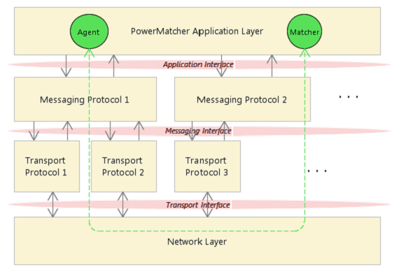

**Figure 1 - Protocol stack**

This figure shows the interaction between a software agent with the PowerMatcher Agent role and a software agent with the PowerMatcher Matcher role through the protocol stack.

-   The ***Application Layer*** implements an ***Application Interface*** for sending and receiving PowerMatcher events, Telemetry events and logging events in a protocol independent manner. The *Application Interface* is implementation dependent.
-   The ***Messaging Layer*** defines a protocol and messages in a transport independent manner in the ***Messaging Interface***. PowerMatcher i3 provides a broadband and a narrowband protocol for PowerMatcher that can be used side by side.
-   The ***Transport Layer*** defines the connection-oriented or connectionless transport of messages between software agents. PowerMatcher i3 provides two publish-subscribe messaging transports.

### Application level protocol

The *Application Layer* implements an *Application Interface* for sending and receiving PowerMatcher and other events in a protocol independent manner. The *Application Interface* is implementation dependent. An example is PowerMatcher i3, where the Application Interface is implemented as a Java API.

### PowerMatcher broadband messaging protocol

The broadband messaging protocol in PowerMatcher i3 is a binary internal protocol. It will be replaced with the standard broadband messaging protocol once the standard has been defined. The broadband protocol is labelled “INTERNAL\_v1”.

### PowerMatcher narrowband messaging protocol

The narrowband messaging protocol in PowerMatcher i3 is a highly optimized binary protocol that is based on the NXP PowerMatcher for the HAN protocol rev. 6. It will be replaced with the standard narrowband messaging protocol once the standard has been defined. The narrowband protocol is labelled “HAN\_rev6”.

### PowerMatcher logging messaging protocol

The protocol adapters for the PowerMatcher broadband and narrowband protocol are also responsible for logging PowerMatcher events. Logging of the events is separated from the events themselves so that events can be logged selectively and with additional information.

Logging is implementation specific and thus not part of the PowerMatcher protocols.

The PowerMatcher logging messaging protocol implemented in PowerMatcher i3 is covered in section 1.7.3.

### Telemetry and control messaging protocol

The PowerMatcher i3 implementation provides a separate protocol for reporting sensor data and remote control of devices. This feature is implementation specific and not part of the PowerMatcher specification.

The telemetry and control messaging protocol implemented in PowerMatcher i3 is covered in section 1.8.

### Transport protocol

#### The messaging bus

In PowerMatcher i3, PowerMatcher, logging, telemetry and other messages are exchanged via a message bus. The message bus is there to facilitate n-m publish/subscribe messaging in a structured way. A publish/subscribe message bus supports loosely coupled components in the following way:

-   A producer can publish messages on the bus on a named topic.
-   When a message is published, it is delivered to all consumers that subscribe to that topic. There can be zero or more subscribers for a topic.
-   A subscriber can subscribe to multiple topics through wildcards.
-   Messages are not queued; a subscriber will not receive matching messages published before the subscription was made.

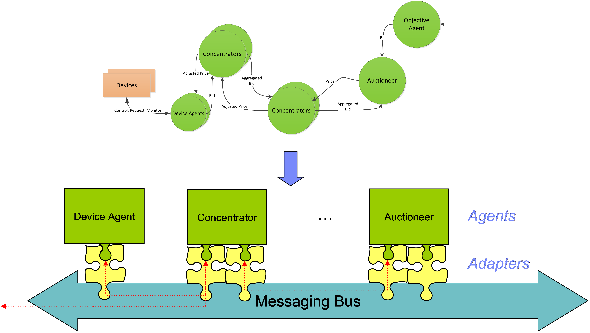

**Figure 2 -- Agents, Adapters and the Messaging Bus**

#### MQ Telemetry Transport

The messaging transport supported in this release is the MQ Telemetry publish/subscribe protocol[1], enabling distributed components residing on different locations with low bandwidth and processing power. The MQTT messages are transported over the TCP/IP network protocol, either in the plain for internal connections, or over SSL/TLS over the Internet. Agents connected to a MQ Telemetry broker act as MQTT-clients.

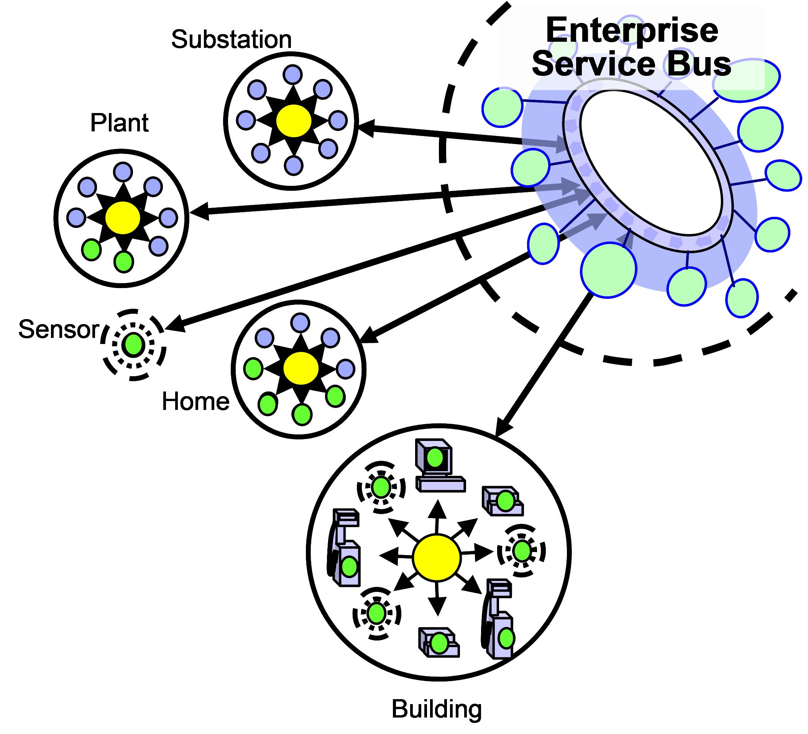

**Figure 3 - MQ Telemetry Transport**

-   MQTT is a machine-to-machine and "Internet of Things“connectivity protocol. It was designed as an extremely lightweight publish/subscribe messaging transport by Arcom and IBM.
    -   The MQTT protocol is public with a royalty-free license.See [<http://mqtt.org>](http://mqtt.org/)
    -   Various open source client and broker implementations exist.
    -   IBM ships commercial implementations, ranging from single device to highly scalable enterprise broker.

<!-- -->

-   Separate adapters for telemetry data collection, project specific interfaces, etc.

Currently popular languages (Java, C/C++, C\#/.NET) and platforms are supported. Examples of commercial MQTT-client software implementations are:

-   The open-source Eclipse Paho C and Java MQTTv3 client connects to, but does not include, a broker. Can connect to Mosquitto, WebSphere MQ, ...

PowerMatcher i3 supports both the MQTTv3 protocol.

Agents, Adapters and the Messaging Bus
--------------------------------------

Subsystems and dependencies in PowerMatcher Foundation
------------------------------------------------------


Figure 4 - Subsystems and dependencies in PowerMatcher Foundation

The Base subsystem
------------------

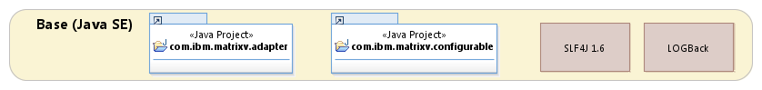

**Figure 5 - Base subsystem**

### ConfigurationService, ConfigurableObject and BaseObject

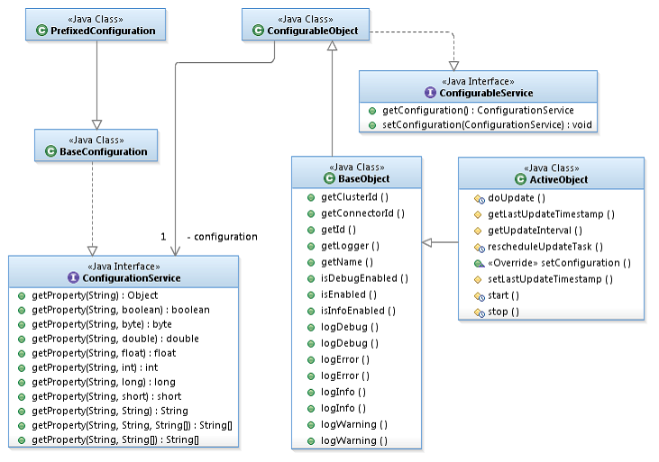

**Figure 6 - ConfigurationService, ConfigurableObject and BaseObject**

### Adapter and Connector

An Adapter provides one of possibly many implementations of services used by other components, including adapters.

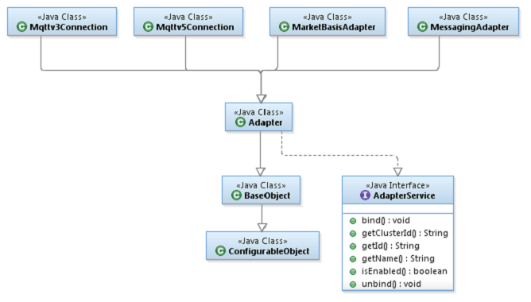

**Figure 7 - Adapter hierarchy**

An Adapter binds itself to the Connector of a component. A ConnectorTracker tracks the lifecycle of component connectors.

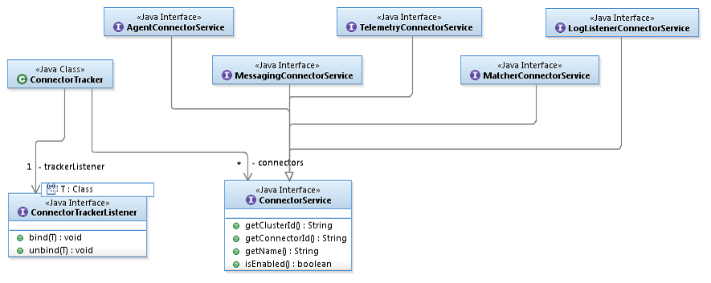

**Figure 8 - Adapter, Connector and ConnectorTracker**

More about this later when discussing specific adapters.

The PowerMatcher Core subsystem
-------------------------------

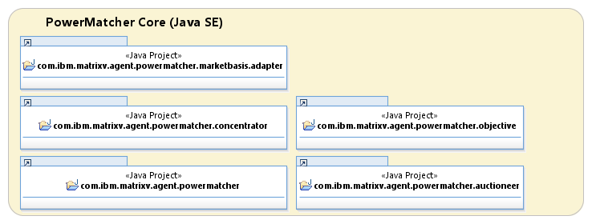

**Figure 9 - PowerMatcher Core subsystem**

### Agent and Matcher role interfaces and framework classes

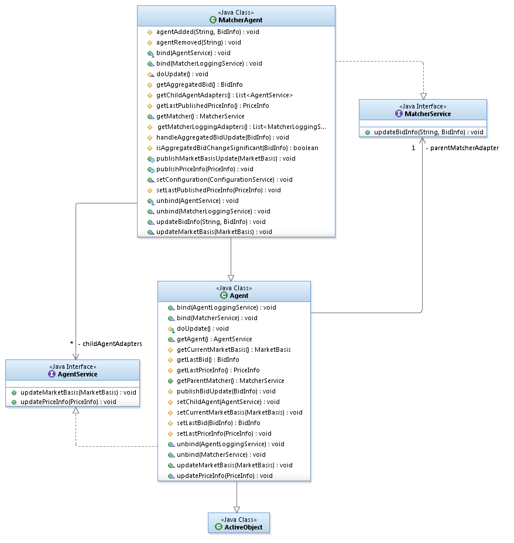

**Figure 10 - Agent and Matcher role interfaces and framework classes**

Agents and Matchers are coupled via the Agent and Matcher interfaces. An agent implements the Agent interface, a matcher the Matcher interface.

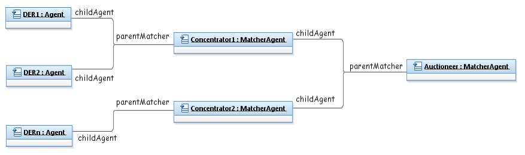

**Figure 11 - Agent and Matcher role coupling**

### MarketBasis, PriceInfo, BidInfo and MarketBasisMapping

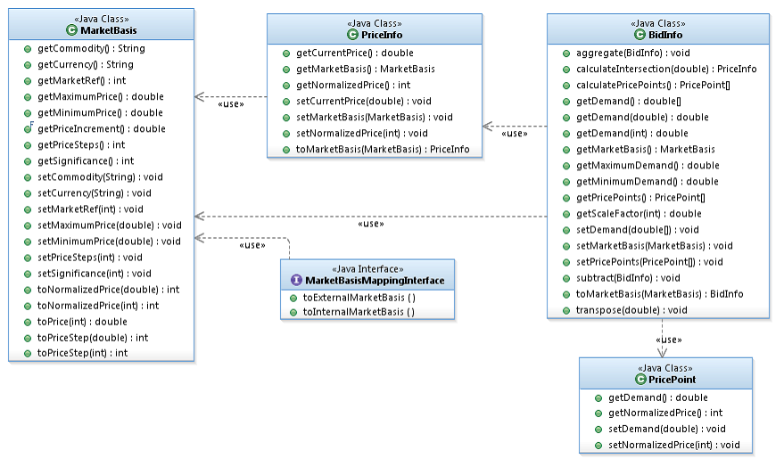

**Figure 12 - MarketBasis, PriceInfo, BidInfo and MarketBasisMapping**

#### Market basis,

In PowerMatcher i3, the market basis is defined by the following attributes:

|**Attribute**             | **Type**              |**Description**  |
|--------------------------|-----------------------|-----------------|
|*market basis reference*  | unsigned integer      | Sequence number for the market basis, starting at 0. The sequence number may wrap between 0 and an arbitrary maximum value 2 ^ n -1, with a minimum of 2 ^ 8 -1 = 255.|
| *commodity*              | string                | Commodity for the market basis, for example "electricity".|
| *currency*               | string                | 3 character ISO-4217 standard representation[2] of the currency for the market basis, for example “EUR”.|
| *minimum price*          | floating point        | Minimum price for the market price.|
| *maximum price*          | floating point        | Maximum price for the market price.|
| *price steps*            | unsigned integer \> 0 | The number of price steps between minimum and maximum price.|
| *significance*           | unsigned integer      | The number of significant digits in the market price[3], 0 = undefined.|


**Table 1 - Market basis attributes**

The minimum price is counted as the first price step, the maximum price as the last. So, for example:

-   Minimum price = € -0.20
-   Maximum price = € 0.50
-   Price step = € 0.10, number of steps is 8

#### Price, normalized price unit and price step

The cluster price is normally expressed as a floating point value, but can also be expressed using a step index relative to the market basis. The price can be expressed as index in two alternative ways.

1.  As price step, starting at index 0 for the minimum price.
2.  As normalized price unit, with an index of 0 for the price closest to 0.0

This is shown in the following example.

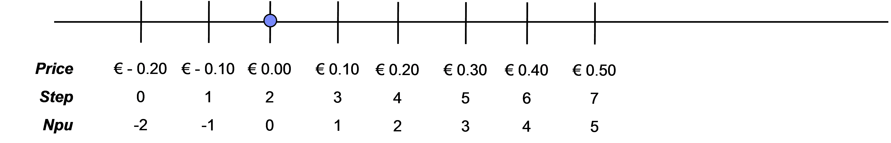

**Figure 13 - Price, price step and NPU example**

#### Bid

A bid specifies the positive or negative demand over a price range, in a decreasing bid curve.

There are two ways to express bids in PowerMatcher i3.

1.  The demand as vector with floating point value for each price step between minimum and maximum price as defined by the market basis.
2.  As a line curve define by price points connected with straight line segments.

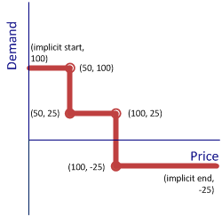

**Figure 14 - Bid line curve example**

The above example a bid curve is show that defines a price step with 2 points:

price[0]= 50

demand[0]= 100

price[1]= 50

demand[1]= 0

-   Note that price 50 is used twice to define a price step using line curve semantics.
-   The demand at price \>= 50 is zero.
-   The demand at price \< 50 is +100.

**Note** that a flat bid curve can be represented by a single demand point where the price is any value in the range of the market basis.

The vector and line curve representation can be converted between one another.

In the PowerMatcher i3 implementation the conversion is current lossless.

-   From curve to vector, the demand at each price step is calculated as the intersection.
-   From vector to curve, the points are calculated for the smallest number of matching line segments.

In a future implementation the conversion from vector to curve and vector to vector (in the case of aggregation) may be constrained by significance or a maximum for the number of price points.

### AgentConnector and MatcherConnector

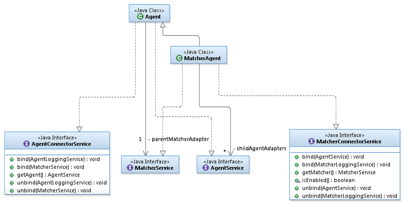

**Figure 15 - AgentConnector and MatcherConnector**

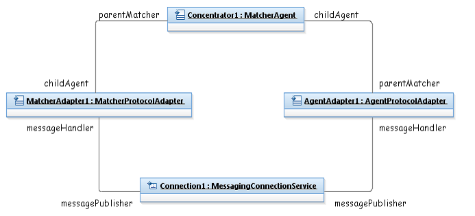

**Figure 16 - Example object diagram for protocol and connection adapters**

Note: one matcher adapter can proxy for multiple agents.

### Agent hierarchy in PowerMatcher Foundation

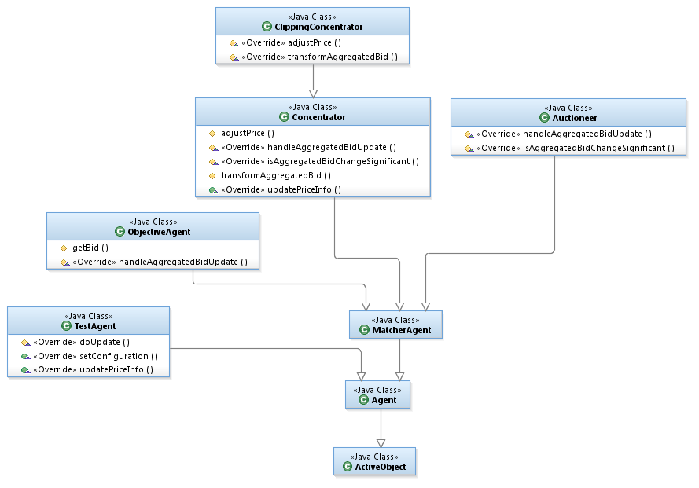

**Figure 17 - Agent hierarchy in PowerMatcher Foundation**

### The Auctioneer

This PowerMatcher component performs the auctioning in the PowerMatcher cluster, and is the top level component in the dependency hierarchy of the PowerMatcher cluster. The auctioneer receives downstream bids from the cluster and publishes the cluster equilibrium price calculated from the most recently received set of bids. The price that is communicated contains a price and a market basis which enables the conversion to a normalized price or to any other market basis for other financial calculation purposes.

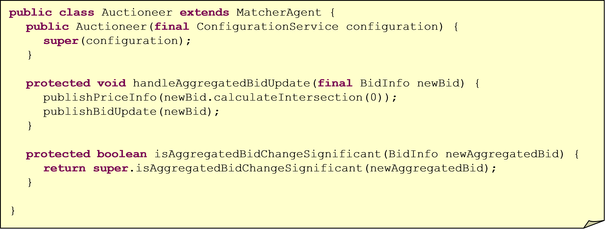

**Figure 18 - Auctioneer code fragment**

1.  Bids are aggregated as they are received (implemented in MatcherAgent)
2.  Method handleAggregatedBidUpdate is called when:
    -   The aggregation result is significantly different.
    -   When the maximum time between updates has expired.
    -   Immediately, when the maximum time between updates is 0.

3.  Auctioneer publishes price update.
4.  Auctioneer also publishes aggregated bid for objective/logging.

Equilibrium price calculation must return correct result for 6 different cases.

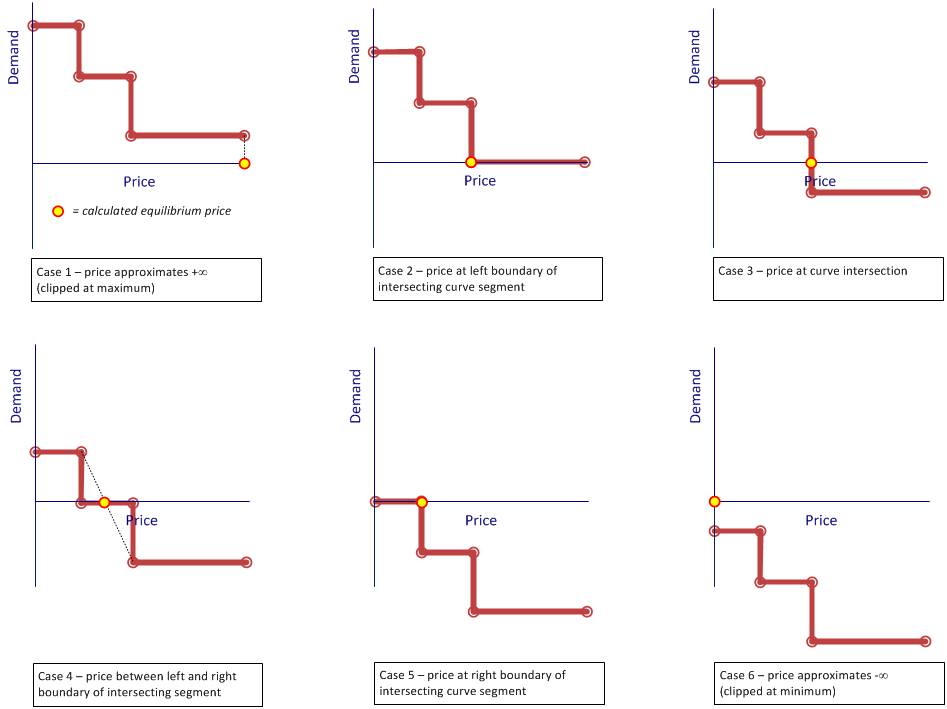

**Figure 19 - Equilibrium price calculation cases**

### The Base Concentrator

A Concentrator is a PowerMatcher component that aggregates bids from its downstream cluster to a single bid that is forwarded upstream to another concentrator or to the auctioneer.

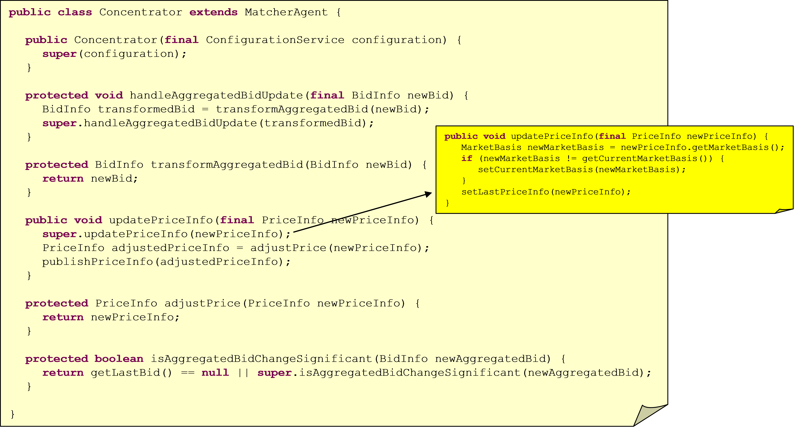

**Figure 20 - Concentrator code fragment**

-   In addition to Auctioneer, Concentrator receives price updates.
-   Framework methods transform/adjust support specialized concentrator implementations, for example for peak shaving.

#### Peak Shaving Concentrators

In a PowerMatcher cluster the demand can be limited or reduced through market price adjustment. This is called peak shaving. Peak shaving is used to reduce the total demand for example at the level of the substation or building. Two different approaches to peak shaving are supported, covered in the following two subsections.

#### The Clipping Peak Shaving Concentrator

In the clipping approach a (variable) upper and/or lower capacity limit is set at the concentrator. Assume that the concentrator is receiving downstream bids that result in the aggregated bid curve as shown in the top-left curve of Figure 21.

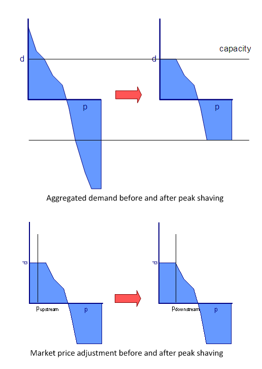

**Figure 21 - Peak shaving by clipping**

The concentrator will manipulate the downstream market price to fulfill the top-right bid curve. The adjusted aggregated bid curve is the clipped curve that the concentrator will submit upstream.

An example of the downstream price adjustment is shown in the bottom curves. If the upstream market price in the cluster is below the price of the cut point, the concentrator will increase the downstream market price to the cut point.

The capacity limits and the net effect of the resulting reduction are set by and reported back to an adapter.

*Note: the connector interfaces and a sample adapter are to be implemented.*

#### The Reducing Peak Shaving Concentrator

In situations where only part of the total load on the substation (for example) is visible at the level of the PowerMatcher Concentrator, the approach most suitable the reduction transformation shown in Figure 22.

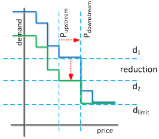

**Figure 22 - Peak shaving through reduction**

1.  The substation total load is measured in near real time and reported to the concentrator via an adapter, together with the desired peak level to the Concentrator.
2.  The Concentrator calculates if, and by how much, the load from the downstream cluster should be (further) reduced to keep the total load below the peak level.
3.  The Concentrator reports the net effect of the requested reduction on the downstream load.

This is achieved as follows.

Assume that the Concentrator is receiving downstream bids that result in the aggregated bid curve as shown in the upper (blue) curve of Figure 22. The concentrator will adjust the downstream market price to transform the upper (blue) curve to the lower adjusted (green) curve. The transformed (green) bid curve is the curve that the concentrator will submit upstream to the auctioneer.

The desired power level d<sub>2</sub>is the reduced level from d<sub>1</sub>, which is the power level at P<sub>upstream</sub> for the untransformed aggregated bid curve. The desired reduction is calculated from the total load and peak level coming from the substation, taking the reduction that is currently in effect into account.

The adjusted P<sub>downstream</sub> price is calculated by determining the price at the intersection of the desired power level d<sub>2</sub> and the untransformed aggregated bid curve. Every time P<sub>upstream</sub>changes, P<sub>downstream</sub> must be recalculated, even if the aggregated bid curve does not change.

Note that there is a limit to which a given peak shaving objective can actually be met.

If, for example, an energy resource must run (for example, once turned the device must be running for a minimum time), it will submit a bid for the demand of the heat pump at any price (the bid curve is a flat line). If in this situation a reduction is requested to reduce the demand below d<sub>limit</sub>, the peak shaving concentrator will adjust the downstream market price to the maximum price, but this will not force the devices to turn off.

*Note: the reducing peak shaving concentrator, the connector interfaces and a sample adapter are to be implemented.*

### The Base Objective Agent

An Objective agent is a PowerMatcher agent that influences the market price to achieve a certain cluster objective through submitting bids to the auctioneer.

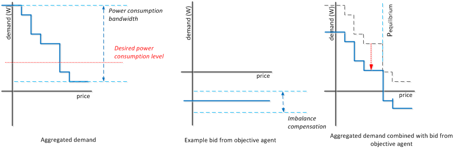

**Figure 23 - Aggregation of the objective bid**

The downstream bids are aggregated by a Concentrator, as shown in the first example bid curve of Figure 23. This gives the bandwidth of the total power consumption of the heat pumps over the price range. The Objective Agent submits a flat bid curve to the Auctioneer to obtain the desired power consumption level, as for example in the second curve. The level of the bid curve the objective agent submits varies with the desired imbalance compensation. The Auctioneer aggregates the first and second bid curves and calculates the equilibrium price, as shown in the last bid curve.

### The CSV Logging Agent

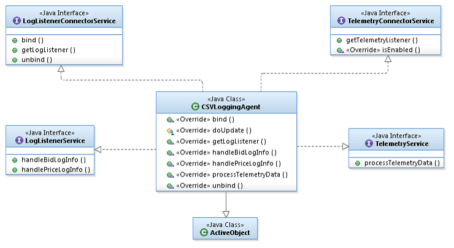

**Figure 24 - The CSV Logging Agent**

The CSV Logging Agent is an example agent that receives PowerMatcher logging events and Telemetry events and logs these events to files in the local file system in comma-separated value format.

The Messaging subsystem
-----------------------

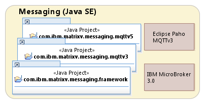

**Figure 25 - Messaging subsystem**

### MessagingAdapter, MessagingConnection and MessagingConnector

A MessagingAdapter is the framework class for protocol, telemetry and custom messaging interfaces. It requires a messaging connection (another adapter).

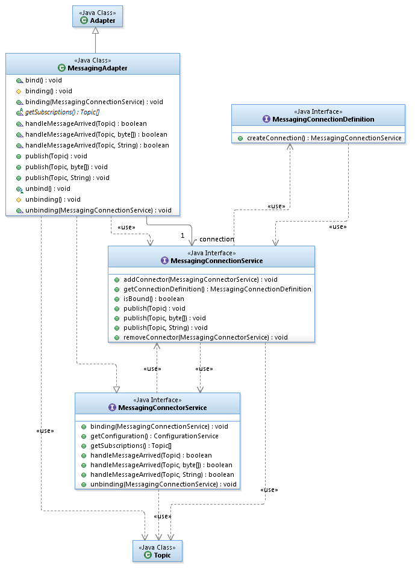

**Figure 26 - MessagingAdapter, MessagingConnection and MessagingConnector**

### MQ Telemetry Messaging Connections

Two messaging connection components have been implemented. One for the open source Eclipse Paho MQTTv3 client, one for the IBM MicroBroker MQTTv5 client.

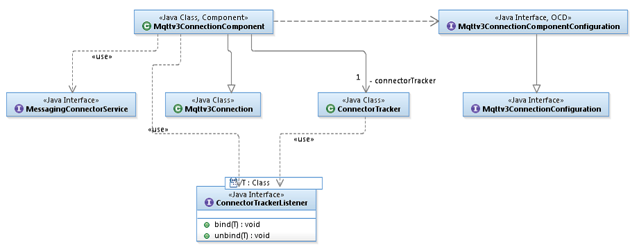

**Figure 27 - Mqttv3Connection**

-   *The Eclipse Paho MQTT client connects to, but does not include, a broker. Can connect to Mosquito, MicroBroker, WebSphere MQ, ...*
-   *MicroBroker is a lightweight Java MQTTv5 broker and bridge shipped in IBM Lotus Expeditor Client 6.x.*

The PowerMatcher Messaging subsystem
------------------------------------

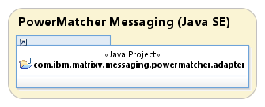

**Figure 28 - PowerMatcher Messaging subsystem**

The PowerMatcher messaging protocol adapters proxy the Agent and Matcher roles. Agent and Matcher roles are implemented in separate adapters (can bridge between protocols).

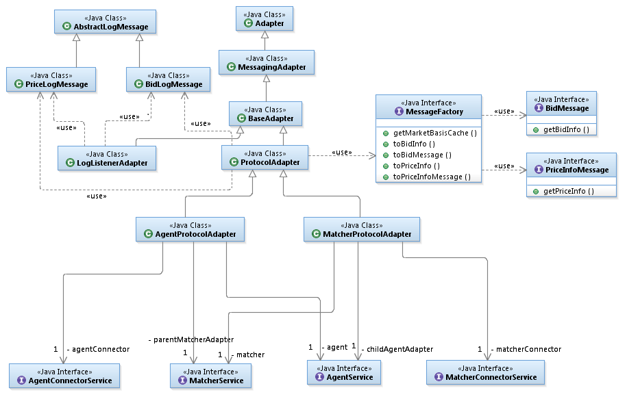

**Figure 29 - PowerMatcher messaging protocol adapters**

### The NXP PowerMatcher for the HAN rev. 6 protocol adapter

The PowerMatcher messaging protocol implemented in this release is based on the message structured proposed by NXP in protocol specification rev. 6.

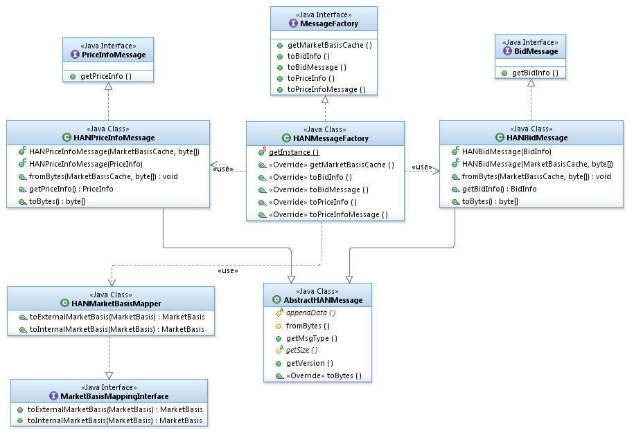

**Figure 30 - NXP PowerMatcher for the HAN rev. 6 protocol adapter**

The protocol defines two messages.

-   **Update Bid message:**The Update Bid message is a message from the agent to the matcher containing a HAN bid, expressing the need for the electricity represented in a normalized bid price and the power demand quantity. The maximum price of a normalized bid is 127. The minimum is -127.
-   **Price Update message:**The new market price is communicated via the Price Update message that is sent by the matcher to the connected agents. This message contains the new market price (in normalized price units). It contains also information to convert it to a ‘real world currency’, if needed.

### The Internal PowerMatcher protocol adapter

The second PowerMatcher messaging protocol implemented in this release is an internal implementation that is a direct, but efficient, mapping of the market basis, price and bid info classes.

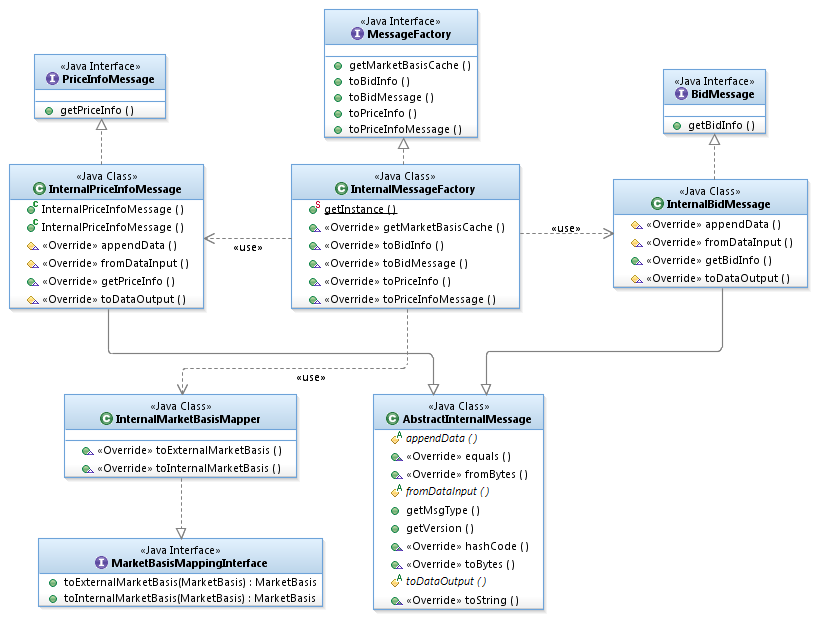

**Figure 31 – The Internal PowerMatcher protocol adapter**

### PowerMatcher logging protocol

It is configurable per agent/matcher what events are logged:

-   The Matcher adapter logs incoming agent bids and the published price (default).
-   The Matcher adapter logs aggregated bid (optional)
-   The Agent adapter logs published bid, received price and market basis updates (optional)

#### Topic namespace for the PowerMatcher logging protocol

The publish/subscribe topic namespace for the PowerMatcher logging has the sane root as for the PowerMatcher events:

PowerMatcher/{clusterId}

where {clusterId} is the simple identifier for the cluster.

The topics for the Price Info and Bid log messages are:

PowerMatcher/{clusterId}/{adapterId}/*UpdatePriceInfo/Log*

PowerMatcher/{clusterId}/{adapterId}/*UpdateBid/Log*

Where:

-   {adapterId} is the identifier of the agent or matcher adapter that is publishing the log messages.
-   The topic suffixes are *UpdatePriceInfo*, *UpdateBid*, and *Log* by default, but are configurable at protocol level.

A logging agent subscribes to receive PowerMatcher log messages using the following wildcard pattern:

PowerMatcher/{clusterId}/+/+/*Log*

The Telemetry Messaging subsystem
---------------------------------

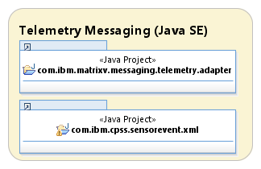

**Figure 32 - Telemetry Messaging subsystem**

### TelemetryData API

Telemetry captures event data in a generic format that we reuse from the West Orange project. In this release stream encoding from Java API is in XML, as specified in the next section.

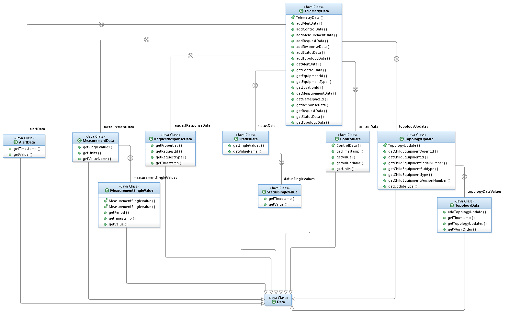

**Figure 33 - TelemetryData class hierarchy**

### Telemetry and Control XML protocol

Measurement, status and other data collected during processing can be reported through the Telemetry interface. This interface specifies an XML message that can contain a variable number of data elements with a name, unit and one or more values.

XML encoding/decoding for the TelemetryData API is provided in separate jar.

The message format is defined by the CPSSchema.xsd and can be found in 1.8.2.1. This schema has its origin in the West Orange project, an energy management pilot in the Amsterdam Smart City initiative. The schema contains elements like ‘measurements’, ‘status’, ‘alert’, ‘control’, ‘request’ and ‘response’ which makes it suitable for all types of messaging. For telemetry we only will use the ‘status’ and ‘measurement’ element types.

The following table lists the most important element definitions for telemetry messages:

| **Element**     | **Type** | **Description**  |
|-----------------|----------|-------------------------------------------------------------------------------------------------------------------------------------------------------------------------------------------------------------------------------------------------------------------------------|
| *namespaceId*   | string   | The id of the realm (customer, project, etc.) for the telemetry message. This is set to the PowerMatcher agent cluster id.                                                                                                                                                    |
| *locationId*    | string   | The unique location id within the namespace for identifying the location where the equipment is installed. This attribute is optional and only required if the back-end system uses the locationId for dynamically updating the location of equipment from Topology messages. |
| *equipmentId*   | string   | Unique id within the namespace for identifying the equipment. This is set to the PowerMatcher agent id.                                                                                                                                                                       |
| *equipmentType* | string   | The equipment type.                                                                                                                                                                                                                                                           |
| *Measurement*   | complex  | Used for measurement data. Specifies the name (e.g. ‘temperature’) and unit (e.g. ‘C’ for ‘Celsius’). Contains one or more measurement values with an optional measurement period in seconds.                                                                                 |
| *Status*        | complex  | Used for status data. Specifies the status name and a child element containing the status value and timestamp.                                                                                                                                                                |

There are no pre-defined values or formats for the string type fields and they are not enforced by the xml schema definition. However, the formats used and values should be known to the receiver (PowerMatcher logging agent) in order to be processed and stored in a database.

#### Topic namespace for the Telemetry messaging protocol

-   Publish topics with topic levels, with a separate namespace per cluster:
    -   CPSS/Telemetry/*clusterId*/*agentId*

<!-- -->

-   Subscribe pattern with topic level wildcard \#:
    -   CPSS/Telemetry/*clusterId*/\#

#### Telemetry message example

The following message illustrates an example of a telemetry message containing 3 measurements with 4 measurement values.

```
<?xml version<nowiki>
=</nowiki>*"1.0"* encoding=*"UTF-8"*?\>

<cpss clusterId<nowiki>=</nowiki>*"WestOrange"* locationId=*"HCB ID"* equipmentId=*"Serial Number Electricity Meter"*

equipmentType=*"electricityMeter"* xmlns=*"<http://www.ibm.com/CPSSSchema>"*

xmlns:xsi=*"<http://www.w3.org/2001/XMLSchema-instance>"*

xsi:schemaLocation=*"<http://www.ibm.com/CPSSSchema> CPSSSchema.xsd "*\>

<measurement valueName<nowiki>=</nowiki>*"currentUsage"* units=*"W"*\>

<singleValue value<nowiki>=</nowiki>*"1.0"* timestamp=*"2001-12-31T12:00:10.000+01:00"*/\>

</measurement>

<measurement valueName<nowiki>=</nowiki>*"meterReading"* units=*"Wh"*\>

<singleValue value<nowiki>=</nowiki>*"2000.0"* timestamp=*"2001-12-31T12:00:00.000+01:00"*/\>

<singleValue value<nowiki>=</nowiki>*"2010.0"* timestamp=*"2001-12-31T12:00:10.000+01:00"*/\>

</measurement>

<measurement units<nowiki>=</nowiki>*"Wh"* valueName=*"periodicUsage"*\>

<singleValue value<nowiki>=</nowiki>*"10.0"* timestamp=*"2001-12-31T12:00:00.000+01:00"* period=*"60"*/\>

</measurement>

</cpss>
```

This example and other examples are included in the code and serve as input for unit testing.

####XSD schema for telemetry and control messages

The XML schema “CPPSSchema” defines a message format that can be used for telemetry, control, alert, request and response messages. It contains a collection of report element definitions types suitable for most plausible data types. 

```
<?xml version="1.0" encoding="UTF-8"?>
<schema targetNamespace='http://www.ibm.com/CPSSSchema' elementFormDefault='qualified' xmlns='http://www.w3.org/2001/XMLSchema' xmlns:tns="http://www.ibm.com/CPSSSchema">
    <element name="cpss" type="tns:CPSSType"></element>
    
    <complexType name="CPSSType">
    	<choice>
    		<element name="measurement" type="tns:MeasurementType" maxOccurs="unbounded" minOccurs="1"></element>
    		<element name="status" type="tns:StatusType" maxOccurs="unbounded" minOccurs="1"></element>
    		<element name="alert" type="tns:AlertType" maxOccurs="unbounded" minOccurs="1"></element>
    		<element name="topology" type="tns:TopologyType" maxOccurs="unbounded" minOccurs="1"></element>
    		<element name="control" type="tns:ControlType" maxOccurs="unbounded" minOccurs="1"></element>
    		<element name="request" type="tns:RequestType" maxOccurs="unbounded" minOccurs="1"></element>
    		<element name="response" type="tns:ResponseType" maxOccurs="unbounded" minOccurs="1"></element>
    	</choice>
    	<attribute name="namespaceId" type="string" use="optional"></attribute>
    	<attribute name="locationId" type="string" use="optional"></attribute>
    	<attribute name="equipmentType" type="string" use="required"></attribute>
    	<attribute name="equipmentId" type="string" use="required"></attribute>
    </complexType>
    <complexType name="MeasurementType">
        <choice minOccurs="0" maxOccurs="unbounded">
    		<element name="singleValue" type="tns:SingleDataValueType">
    		</element>
    	</choice>
    	<attribute name="valueName" type="string" use="required"></attribute>
    	<attribute name="units" type="string" use="required"></attribute>
    </complexType>
    <complexType name="StatusType">
        <choice minOccurs="0" maxOccurs="unbounded">
    		<element name="singleValue" type="tns:SingleStatusValueType"></element>
    	</choice>
    	<attribute name="valueName" type="string" use="required"></attribute>
    </complexType>
    <complexType name="AlertType">
    	<attribute name="value" type="string" use="required"></attribute>
    	<attribute name="timestamp" type="dateTime" use="required"></attribute>
    </complexType>
    <complexType name="TopologyType">
        <choice minOccurs="0" maxOccurs="unbounded">
    		<element name="add" type="tns:AddTopologyType"></element>
    		<element name="delete" type="tns:DeleteTopologyType"></element>
    		<element name="change" type="tns:ChangeTopologyType"></element>
        </choice>
    	<attribute name="timestamp" type="dateTime" use="required"></attribute>
    	<attribute name="workOrder" type="string" use="optional"></attribute>
    </complexType>
    <complexType name="ControlType">
    	<attribute name="valueName" type="string" use="required"></attribute>
    	<attribute name="value" type="string" use="required"></attribute>
    	<attribute name="timestamp" type="dateTime" use="required"></attribute>
    </complexType>
    <complexType name="RequestType">
        <choice minOccurs="0" maxOccurs="unbounded">
    		<element name="property" type="tns:PropertyType"></element>
        </choice>
    	<attribute name="requestType" type="string" use="required"></attribute>
    	<attribute name="requestId" type="string" use="optional"></attribute>
    	<attribute name="timestamp" type="dateTime" use="required"></attribute>
    </complexType>
    <complexType name="ResponseType">
        <choice minOccurs="0" maxOccurs="unbounded">
    		<element name="property" type="tns:PropertyType"></element>
        </choice>
    	<attribute name="requestType" type="string" use="required"></attribute>
    	<attribute name="requestId" type="string" use="required"></attribute>
    	<attribute name="timestamp" type="dateTime" use="required"></attribute>
    </complexType>
    
    <complexType name="SingleDataValueType">
    	<attribute name="value" type="float" use="required"></attribute>
    	<attribute name="timestamp" type="dateTime" use="required"></attribute>
    	<attribute name="period" type="int" use="optional"></attribute>
    </complexType>
    <complexType name="SingleStatusValueType">
    	<attribute name="value" type="string" use="required"></attribute>
    	<attribute name="timestamp" type="dateTime" use="required"></attribute>
    </complexType>
    <complexType name="AddTopologyType">
    	<attribute name="childEquipmentType" type="string" use="required"></attribute>
    	<attribute name="childEquipmentSubtype" type="string" use="optional"></attribute>
    	<attribute name="childEquipmentId" type="string" use="required"></attribute>
    	<attribute name="childEquipmentVersionNumber" type="string" use="optional"></attribute>
    </complexType>
    <complexType name="DeleteTopologyType">
    	<attribute name="childEquipmentType" type="string" use="required"></attribute>
    	<attribute name="childEquipmentId" type="string" use="required"></attribute>
    </complexType>
    <complexType name="ChangeTopologyType">
    	<attribute name="childEquipmentType" type="string" use="required"></attribute>
    	<attribute name="childEquipmentSubtype" type="string" use="optional"></attribute>
    	<attribute name="childEquipmentId" type="string" use="required"></attribute>
    	<attribute name="childEquipmentVersionNumber" type="string" use="optional"></attribute>
    </complexType>
    <complexType name="PropertyType">
		<attribute name="name" type="string" use="required"/>
		<attribute name="value" type="string" use="required"/>
		<attribute name="logging" type="boolean" default="true" use="optional"/>
    </complexType>
</schema>
```

### TelemetryAdapter and TelemetryConnector

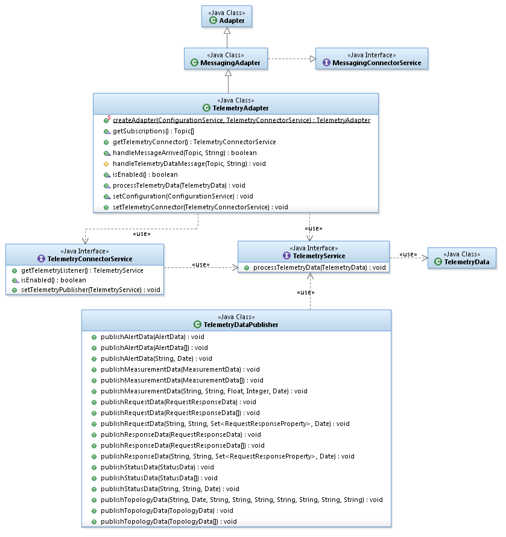

**Figure 34 - TelemetryAdapter and TelemetryConnector**

The telemetry model should be generalized and abstracted out into service and publisher in framework if it is to be included in the reference implementation.

The PowerMatcher Samples subsystem
----------------------------------

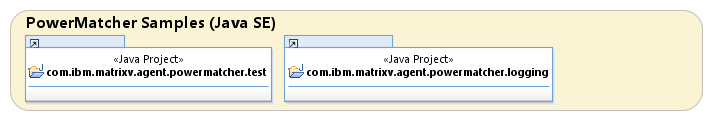

**Figure 35 - PowerMatcher Samples subsystem**

### The Framework TestAgent

The TestAgent can be configured to publish a series of single step bids with lineary change in price and power.

### The CSVLoggingAgent

The CSVLoggingAgent logs the following in csv files at a fixed interval:

1.  All received single step PowerMatcher device bids with related market price.
2.  All received telemetry measurement and status messages.

#### PowerMatcher logging

Bids:

-   Timestamp
-   Location ID
-   Agent ID
-   Bid number
-   Bid curve
-   Market basis ID

Price updates:

-   Timestamp
-   Location ID
-   Price update number
-   Market price
-   Market basis ID

Market basis updates:

-   Timestamp
-   Market basis ID
-   Commodity (Electricity)
-   Minimum price
-   Maximum price
-   Price steps

#### Telemetry logging

Measurement data:

-   Timestamp
-   Location ID
-   Equipment type
-   Equipment ID (=correspond to Powermatcher Agent ID)
-   Measurement type
-   Measurement unit
-   Measurement value
-   Measurement period (optional)

Status data:

-   Timestamp
-   Location ID
-   Equipment type
-   Equipment ID (=correspond to Powermatcher Agent ID)
-   Status type
-   Status value

The OSGi Runtime subsystem
--------------------------

Although PowerMatcher applications can be run as plain Java applications, the OSGi platform provides dynamic configuration and software updates.

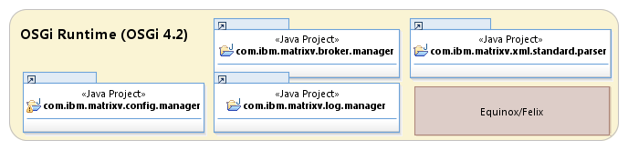

**Figure 36 - OSGi Runtime subsystem**

### BrokerManager

Creates and configures local MQTT MicroBroker instance.

Configuration of MicroBroker Bridge for bridging topics between local and remote MQTT broker.

-   Requires MicroBroker license (included with IBM Lotus Expeditor Device client)
-   Requires Equinox, Felix is not supported by MicroBroker.

### ConfigManager

Reads XML configuration specification for OSGi runtime from URL.

Processes dynamic configuration updates (add, update, delete) in OSGi ConfigAdmin.

### Other OSGi Runtime bundles

Other bundles are utility bundles needed on top of standard Equinox/Felix OSGi runtimes and base bundles.

### OSGi Runtime Deployment

There are 3 possible deployment options, as depicted in the following diagram: standalone with an embedded MicroBroker, standalone with an external broker, or distributed with a central enterprise broker.

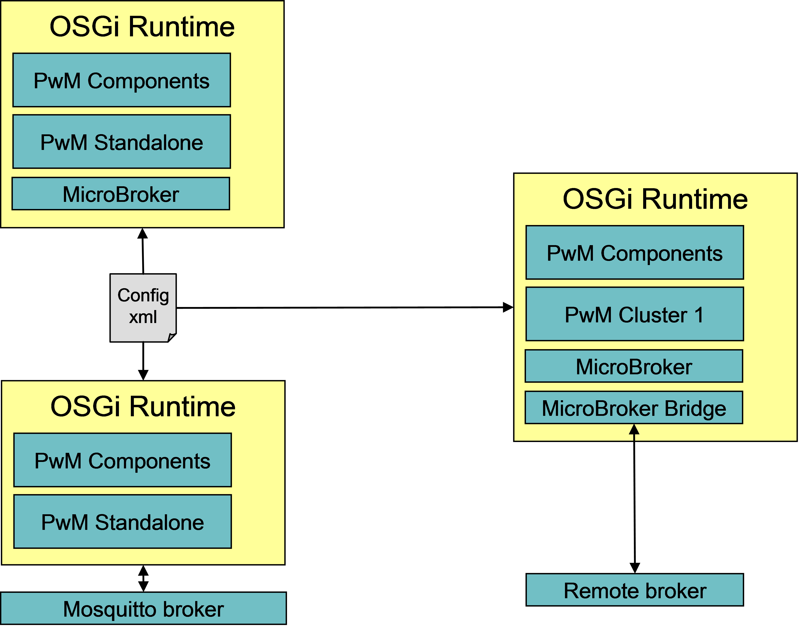

**Figure 37 - OSGi Runtime deployment options**

The Service Components subsystem
--------------------------------

Components are implemented according to the OSGi Service Component Model (SCM).

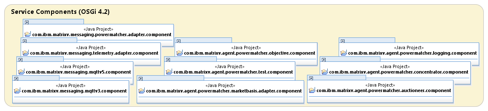

**Figure 38 - Service Components subsystem**

-   Component and configuration metadata is generated from the commonly used aQute SCM annotations
-   Strict separation from Java SE components to isolate and minimize OSGi dependencies.
-   Components are instantiated from persistent OSGi configuration managed via the OSGi ConfigurationAdmin service.
    -   Singleton components.
    -   Factory components.
-   Components dynamically register services in the OSGi service registry, like for example connector services.
-   Adapter components track connector services (and other services) in the OSGi service registry, and bind to/bind from connectors as they become available/disappear.

### Messaging Connection Components

Components to provide a messaging connection, using a tracker for MessagingConnectorService interfaces registered by other components that require a messaging connection.


**Figure 39 - Mqttv3ConnectionComponent and ConnectorTracker**

### PowerMatcher Protocol Adapter Components

Component to provide a PowerMatcher protocol adapter, using a tracker for Agent- and MatcherConnectorService interfaces registered by PowerMatcher components that require either an Agent adapter or and Agent and a Matcher adapter.

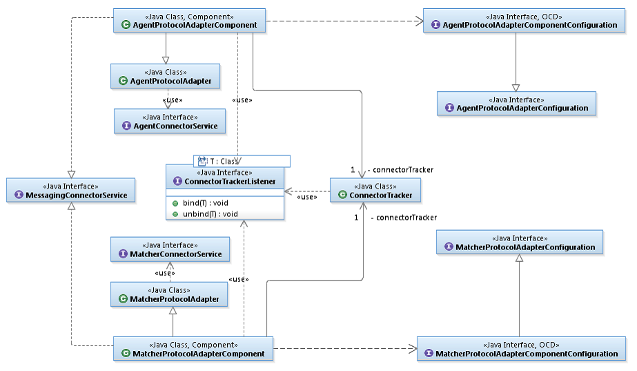

**Figure 40 - Agent- and MatcherProtocolAdapterComponent**

### Telemetry Adapter Component

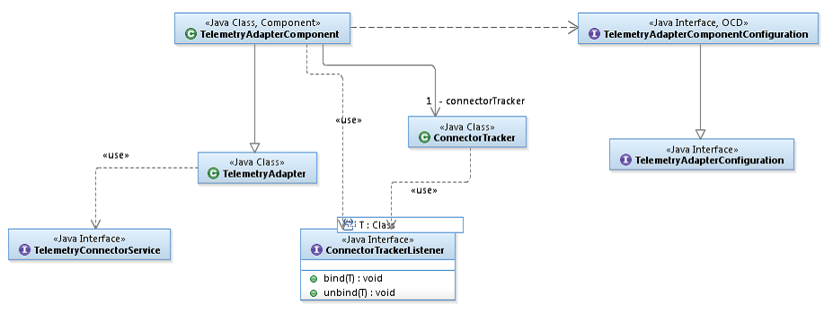

**Figure 41 – TelemetryAdapterComponent**

Components to provide an adapter for publishing and (optionally) receiving telemetry events, using a tracker for TelemetryConnectorService interfaces registered by other components that require a telemetry connection.

------------------------------------------------------------------------

