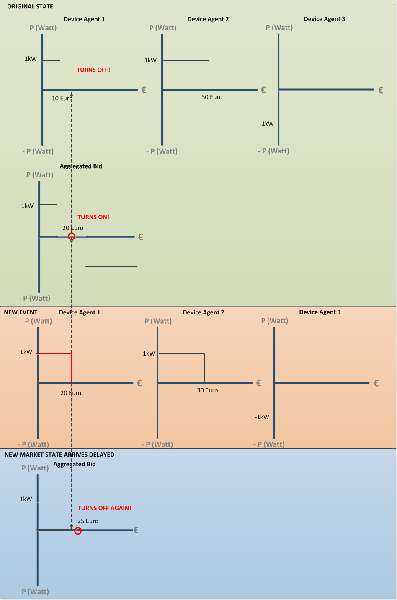
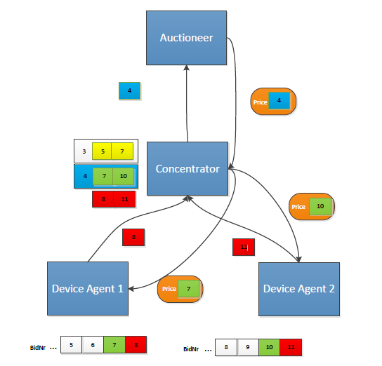

# BidNumbers

We have implemented a feature that ties a bid(Number) to a returned Price, see the [Messages section](Messages.md). Why? so a Device Agent knows when receives a priceUpdate to which original bid(Number) it belonged. This feature is implemented to counter oscillative behaviour...

-----------------------------------------------
# Oscillation behaviour

Without this feature the situation could happen that a Device Agent could act on the wrong price....and ultimately oscillative behaviour would occur. Let me explain with a small thought exercise:

* Device Agent 1: For a price <= 10 it will consume 1 kW, for a price  > 10 it will consume nothing or 0 kW

* Device Agent 2: For a price <= 30 it will consume 1 kW, for a price  > 30 it will consume nothing or 0 kW

* Device Agent 3 (PV panel): The PV panel will produce 1 kW, and offer it for every price.

This will results in a market price of 20: Device Agent 1 consumes 0 kW (20>10), Device Agent 2 consumes 1 kW (20<30) and the PV panel produces 1 kW: the market is in balance!

See Figure 1:



**Figure 1: Oscillation occurs!**

Now an event occurs that Device Agent 1 is willing to pay a little extra (for instance the deadline of the Electric Vehicle was reset earlier in time). Now the new situation becomes:

* Device Agent 1: For a price <= 20 it will consume 1 kW, for a price  > 10 it will consume nothing or 0 kW

* Device Agent 2: For a price <= 30 it will consume 1 kW, for a price  > 30 it will consume nothing or 0 kW

* Device Agent 3 (PV panel): The PV panel will produce 1 kW, and offer it for every price.

Remember the moment Device Agent 1 sends out the new bidcurve nr2, it knows the current market price to be 20.

If Device Agent 1 assumes that price 20 is the correct and current price it will conclude that his new bidcurve allows him to start consuming energy. Device Agent 2 en the PV panel are not aware of the change in the system and will continue at their original level. This will result in an imbalance of 1kW.

However, if Device Agent 1 would have waited for the new market price it would know that it was about to be turned off again. Namely, his own bid (bidnr 2) would have had an effect that resulted in a new market price of 25. 

The conclusion is that Device Agent 1 acted too soon, if he had known that the price known to him belonged to his old bidcurve he would not have acted and waited for the new market price that has processed his bid.

# The Solution

Hence as a solution we have added a mechanism so that a Device Agent can receive a price with the bidNumber that has been processed by the Auctioneer. 

Figure 2 should make this more clear:


**Figure 2: The solution mechanism to solve oscillation**

Device Agent 1 has sent out his last bid with bidNr 8. Device Agent 2's latest bid is nr 11. However the Concentrator's latest Did was nr 4. When the Concentrator sent out bid nr 4 the bidNumbers known to him were nr 7 and 10. The Auctioneer also keeps a records of latest received bids and sees that the new price belongs to bid nr 4 for that particular Concentrator. The Concentrator receives a price update for bid nr 4, it then looks up the relevant bidNumbers for his children and finds that this was nr 7 and 10 (NOT 8 and 11). He forwards the new market price but attaches the specific bidNumbers for the respective Device Agents.

The Device Agents have now received valuable new information. It is up to the designer of the Device Agent to implement the right logic. A simple implementation would "ignore" the price that has not processed its latest bid and wait for a new priceUpdate. If not it could mean that your device turns on but, is turned off again two minutes later; this is probably undesired behaviour.

# Technical Implementation

In order to send specific bidNumbers to the correct Device Agents (Device Agent 1 could be running at bidNr 20 whilst Device Agent 2 could be running at bidNr 3403) the Concentrator has to keep track of the latest bids belonging to each Device Agent.

More specifically, every time that a Concentrator aggregates a Bid and sends a new bid up the hierarchy, it stores the Bid with `saveBid()` in a register called `SentBids`:

```
    private final BaseMatcherEndpoint matcherPart = new BaseMatcherEndpoint() {
        @Override
        protected void performUpdate(AggregatedBid aggregatedBid) {
            Bid bid = transformBid(aggregatedBid);
            BidUpdate bidUpdate = publishBid(bid);
            saveBid(aggregatedBid, bidUpdate);
        };
    };
```
Where `sentBids` is a LinkedList:

```
    private final Deque<SentBidInformation> sentBids = new LinkedList<SentBidInformation>();
```

The elements that are stored in `SentBids` are new objects called `SentBidInformation`. The `SentBidInformation` stores an `AggregatedBid` (the original incoming Bids, including their bidNumbers) and pairs it with the `BidUpdate` (the outgoing message, with its own bidNumber). 

```
    void saveBid(final AggregatedBid aggregatedBid, final BidUpdate sentBidUpdate) {
        SentBidInformation info = new SentBidInformation(aggregatedBid, sentBidUpdate);

        synchronized (sentBids) {
            sentBids.add(info);

            if (sentBids.size() > MAX_BIDS) {
                LOGGER.warn("The number of generated bids is becoming very big, possible memory leak?");
                while (sentBids.size() > MAX_BIDS) {
                    sentBids.removeFirst();
                }
            }
        }
    }
```
Now when a Concentrator receives a returned priceUpdate it will retrieve the `SentBidInformation` with `retrieveAggregatedBid`, look up the original bidNumbers from the Bids that were received from the children, and consequently publish the price to each child with its corresponding bidNumber: `getOriginalBid()`.

```
    @Override
    public void handlePriceUpdate(PriceUpdate priceUpdate) {
        super.handlePriceUpdate(priceUpdate);

        try {
            SentBidInformation info = retrieveAggregatedBid(priceUpdate.getBidNumber());
            Price price = transformPrice(priceUpdate.getPrice(), info);
            matcherPart.publishPrice(price, info.getOriginalBid());
        } catch (IllegalArgumentException ex) {
            LOGGER.warn("Received a price update for a bid that I never sent, id: {}", priceUpdate.getBidNumber());
        }
    }
```
 The function `retrieveAggregatedBid()` is important because it also removes SentBidInformation-objects that reside in the past and will not be used anymore:

```
    private SentBidInformation retrieveAggregatedBid(int bidNumberReference) {
        synchronized (sentBids) {
            // First check if we have actually sent a bid with that number
            boolean found = false;
            for (SentBidInformation info : sentBids) {
                if (info.getBidNumber() == bidNumberReference) {
                    found = true;
                }
            }

            // If we haven't, then throw an exception
            if (!found) {
                throw new IllegalArgumentException("No bid with bidNumber " + bidNumberReference + " is available");
            }

            // If we have, drop all older bids and return the found info
            SentBidInformation info = sentBids.peek();
            while (info.getBidNumber() != bidNumberReference) {
                sentBids.removeFirst();
                info = sentBids.peek();
            }
            return info;
        }
    }
```


--------------------------------------------------

IMPORTANT: It is still possible that a Device Agent will never receive a priceUpdate in time for his new bidUpdate. This happens when the update interval of the Device Agent is much faster than the **Cooldown Period** of (multiple) Concentrator(s), see [Events & Scheduling](Events & Scheduling). That is why we advice the developer of a Device Agent to adopt a minimum bidUpdate interval which is at least >> 5 * Cooldown period! 
