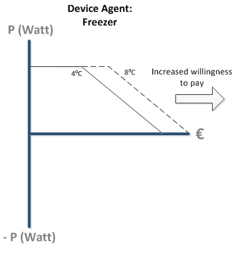
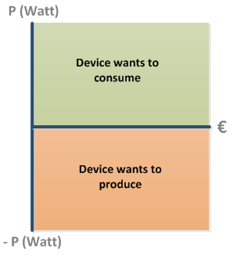

Earlier we described the Device Agent as follows:

The device agent is connected to both the PowerMatcher and to the physical smart device. The device agent sends bids and receives prices from the PowerMatcher, by acting on the market it also influences the market. The device agent sends new setpoints (based on market prices) to the device and receives information on its current state (that can result in new bids). See Figure 1 for an overview:

**Figure 1: The position of Device Agent**

# Business Logic

The business logic receives flexibility information from the smart Device and translates that to new Bids. Take for example a Bid of a Freezer that has heated up from 4 degrees Celcius to 8 degrees Celcius:

**Figure 2: Due to increased internal Temperature (4 -> 8 Celcius) is willing to pay more**

Due to changed state of the sytem: the inner temperature is too high; the device Agent is willing to pay more. When determining the desired Bid it can also take into account user preferences; for instance "I never want the Freezer to get above >10 degrees Celcius"

Vice versa the Device Agent receives prices from the market. See [[Equilibrium Price|Equilibrium]] for more information on how this price balances the market. For now understand that the price results in a new setpoint.

**Important to understand** is that the Device Agent does **NOT overwrite the embedded control system** of the device itself. We surely are not trying to destroy device! The embedded control systems knows best what the safety limits are of the device...smart devices will have an API that lets you externally set some setpoints. With the Freezer this could be to set the desired inner temperature and possibly the ramp speed.

# Bids

So how do you determine the demand-price relationship of a Bid?!

Well, simply put, you can start by determining the **marginal cost** of the device. Take for example a Fuel Cell (forget heat ouput for the moment):

In order to produce a certain amount of electricity (Watt) it needs a certain amount of m3 gas. You know the price and energy content of gas. At a certain power level it is running at an efficiency that might also degrade over time. So you get something like this:

`Marginal Cost[Euro/kWh] = (gas.price[euro/m3] * 3.6[MJ/kWh]) / (gas.e[MJ/m3] * efficiency(Watt, Age))`

() = function off

[] = units

Bids that represent generation of energy, demand ‘negative power’ and are therefore negative. Consumption Bids are represented by positive Bids. 

**Figure 3: Consumption and Production Bids**

Please read [[Data Objects| https://github.com/flexiblepower/powermatcher/wiki/API-DataObjects]] section to understand how Bids and Prices are defined technically.

# Technical Implementation

For a detailed explanation and walkthrough on the technical implementation of a Device Agent the reader is referred to th tutorial section:
[[Creation of a Device Agent|CreationOfDeviceAgent]]

-------------------------

Now that you know about the origin of Bids, learn how they are aggregated in [[Aggregation|Aggregation]]