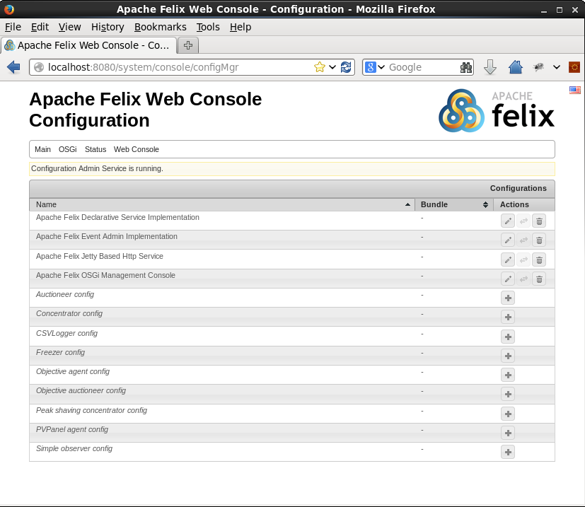
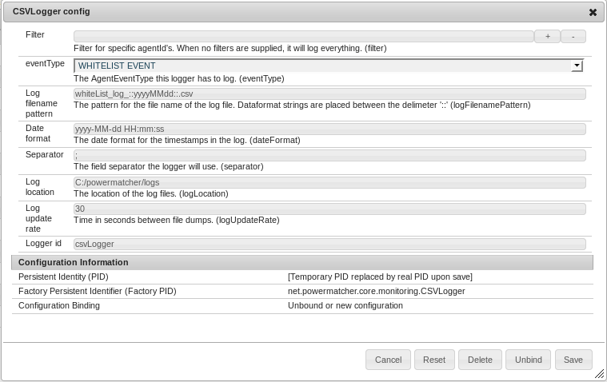
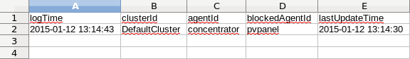

#Overview

The `CSVLogger` is an `AgentEventLogger` that logs to a comma seperated file. A CSV Logger will log a specified `AgentEvent` for one or more `ObservableAgents`. At a set interval, the data will be written to a CSV file.

This section will explain how to start the CSV logger and how you can configure and use it. 

## Starting up Powermatcher in OSGI

Start the example.bndrun and open the felix webconsole, as described [here](../SimplePMCluster#starting-up-powermatcher-in-osgi).

In the menu, select OSGi -> configuration to open the configuration manager. 

Create a concentrator with `freezer` in its whitelist. This means only agents with the agentId `freezer` will be allowed in a session with concentrator.



## Creating a new CSV Logger

We will create a CSVLogger that will log all WhiteList Events in the cluster. The file will be placed in `C:/powermatcher/logs` and the filename will be `whiteList_log_*today*.csv`

Click on the + button at the end of the `CSVLogger config` line to create a new `CSVLogger` and add the following values.



When you click on save, This AgentObserver will be attached to concentrator. 

The eclipse console will contain the following output:

```
INFO  n.p.core.monitoring.BaseObserver - Attached to observable [concentrator]
INFO  n.p.core.monitoring.AgentEventLogger - CSVLogger [csvLogger], activated
```

Next, try to create a `pvPanel` with `concentrator` as its `desiredParentId`. This will trigger a WhiteListEvent. The CSVLogger will receive it and log to the console.

```
AgentEventLogger [csvLogger] received event: clusterId = DefaultCluster, agentId = concentrator, timestamp = Mon Jan 12 13:14:30 CET 2015 blocked agent pvpanel
```

Every 30 seconds, the CSVLogger will log all received WhiteListEvents to file. This will also be logged to console.

```
INFO  n.p.core.monitoring.AgentEventLogger - CSVLogger [csvLogger] wrote to C:/powermatcher/logs/whiteList_log_20150112.csv
```

## The CSV file

The CSV file can be opened as a regular file, or with a spreadsheet application.

