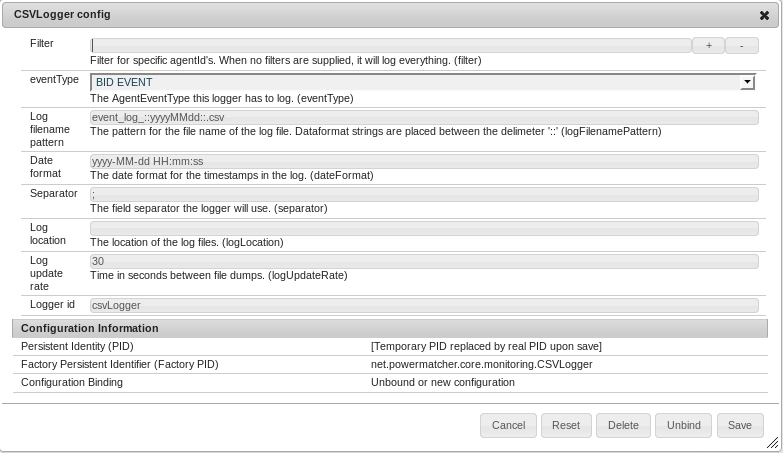

# The CSVLogger

The `CSVLogger` is an `AgentEventLogger` that logs to a comma separated file. A CSV Logger will log a specified `AgentEvent` for one or more `ObservableAgents`. At a set interval, the data will be written to a CSV file.

This section will explain how to start the CSV logger and how you can configure and use it. 

## Starting up Powermatcher in OSGI

Start the example.bndrun and open the felix webconsole, as described in the tutorial [Simple PM Cluster](SimplePMCluster.md).

In the menu, select OSGi -> configuration to open the configuration manager. 

Create a concentrator with `Freezer`. 


## Creating a new CSV Logger

We will create a CSVLogger that will log all Bid Events in the cluster. The file will be placed in `C:/powermatcher/logs` and the filename will be `event_log_*today*.csv`

Click on the + button at the end of the `CSVLogger config` line to create a new `CSVLogger` and add the following values.



When you click on save, This AgentObserver will be attached to the Concentrator. 

The eclipse console will contain the following output:

```
INFO  n.p.core.monitoring.BaseObserver - Attached to observable [concentrator]
INFO  n.p.core.monitoring.AgentEventLogger - CSVLogger [csvLogger], activated
```

When the Freezer sends out a bid this will trigger an IncomingBidEvent at the Concentrator. The CSVLogger will receive it and log to the console.

```
todo
```

Every 30 seconds, the CSVLogger will log all received Events to a file. This will also be logged to console.

```
todo
```

## The CSV file

The CSV file can be opened as a regular file, or with a spreadsheet application.

