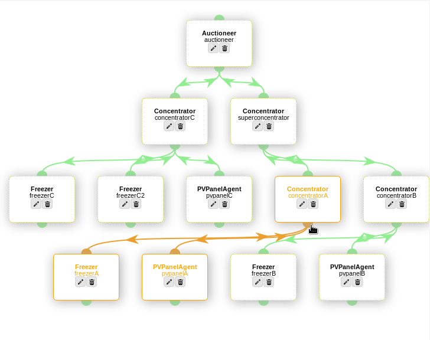

# Visualisation

In the previous PowerMatcher implementation there was hardly any visual feedback, apart from the eclipse console output that told us the Agents were activated and that sessions had started. 
The Visualizer is a graphical shell on top of the Configuration Admin, with the addition of session visualization. You can use the visualizer and the Configuration Admin at the same time. Agents added in the Configuration Admin will be shown in the visualizer after a page refresh and visa versa. 

**Figure 1: Visualize your PowerMatcher cluster**

Please continue to the tutorial [Visualizer](Visualizer.md) to learn how to configure your PowerMatcher cluster visually.