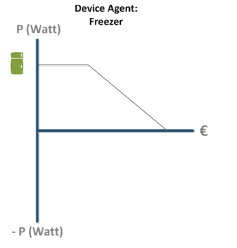
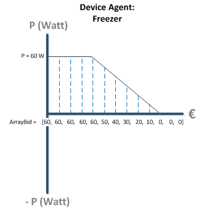
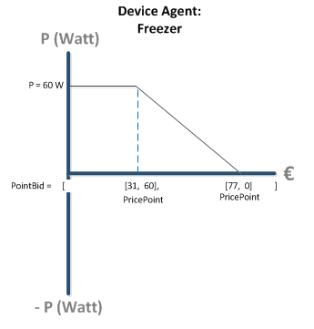

# Bids & Prices and other DataObjects

The PowerMatcher protocol consists of few different Data Objects passed from one Agent to the other. Obviously there is the Bid and the Price, but these base objects can be defined in different ways. Remember that a Bid represents an entire bidcurve as shown in Figure 1:



**Figure 1: A Bid always describes the full demand-price relationship and is therefore a _bidcurve_ which can be non-continuous, but is always strictly descending**

------------------------------------------

# Bid   

Bid is an abstract class that defines the basic functions we want to perform on a Bid such a `calculateIntersection()`, `getMaximumDemand()`, etc.

It does not yet define the coordinates of the bid curve! For this the abstract class can be implemented in two different ways: the ArrayBid and the PointBid.

##ArrayBid

The ArrayBid extends "Bid" and is an immutable data object:

`    private final double[] demandArray;`

it uses an array to store the Y coordinates of the bid curve where the X coordinates are implicitly defined by a fixed interval (as defined by the MarketBasis). Figure 2 will help you understand:



**Figure 2: An ArrayBid**

The advantage of defining a bidcurve as a demandArray is that it is very easy to add or subtract other bidcurve that are mapped to the same X-coordinates. This is also the reason that an AggregatedBid (after leaving concentrator) is always of the type ArrayBid.

The disadvantage is that you will aways have a lot of 'datapoints' describing a bidcurve.

##PointBid

The PointBid extends "Bid" and is an immutable data object:

`        private final SortedSet<PricePoint> pricePoints;`

it stores a set of pricePoints (see further on in this section) instead of a demandArray. Each pricePoint is a X-Y coordinate pair and describes a cornerpoint of the bidcurve. There is no need to define the cornerpoint that lies on X = 0 and X = endofMarktBasis; PowerMatcher will draw implicit horizontal lines that connect the first and the last pricePoint to the extremes of the MarketBasis.



**Figure 3: A PointBid**

The advantage of a PointBid is that it is very intuitive for a human being to describe a bidcurve in comparison to a demandArray (where you might have to enter 1000 datapoints). Therefore it is most likely that Device Agents will generate Bids in the form of PointBids where the cornerpoints are the result of the Business Logic that was implemented by a human.  

The disadvantage is that two PointBids are much harder to add or subtract from one another (this will require interpolation).

#MarketBasis

The MarketBasis is an immutable data object that defines the market. Every Agent's Bid or Price is based on the MarketBasis.

The MarketBasis registers:

* the price range
* the commodity
* the currency
* the number of price steps used in the demand arrays.

```
    private final String commodity;
    private final String currency;
    private final int priceSteps;
    private final double minimumPrice;
    private final double maximumPrice;

```

#Price: 

The Auctioneer determines the Equilibrium Price. This price is the set point that optimizes the entire cluster. The price flows through every branch (stored in PriceUpdate Objects) and down to every end node, the Device Agent. The device agent maps this price to his prior published bid curve (see [[Equilibrium Price|Equilibrium]]) and determines its consumption or production set point.

Price is an immutable dataobject:

`    private final double priceValue;`

#PricePoint

A PricePoint represents the X,Y coordinate, a cornerpoint, on a bidcurve. See Figure 3, the PointBid. A PricePoint holds a demandvalue and  a Price Object.

```
    private final Price price;
    private final double demand;

```

#PriceStep

A priceStep is the index of a `demandArray`. This is an integer and can be any value between 0 and marketbasis.priceSteps.

A priceStep is an immutable data object.

`    private final int priceStep;`

The value 0 corresponds to the minimum price and marketbasis.priceStep - 1 corresponds to the the maximum price.
The function toPrice() returns the Price that the PriceStep belongs to:

```  

    public Price toPrice() {
        return new Price(marketBasis, marketBasis.getMinimumPrice() + priceStep * marketBasis.getPriceIncrement());
    }

```
 
