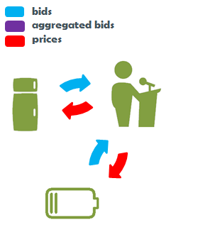
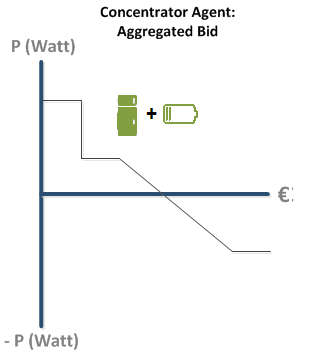
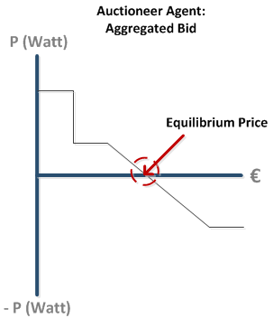
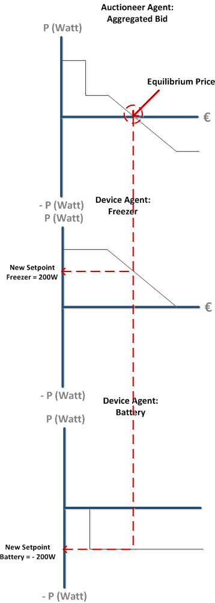

# The Equilibrium Price

Make sure you have read the [Aggregation](Aggregation.md) section before you continue. 

Assume that we now have a very small cluster with only two Device Agents: the Freezer and the Battery, and the Auctioneer. See Figure 1:



**Figure 1: A very small PowerMatcher Cluster.**

The Auctioneer receives an Aggregated Bid similar to the Bid in [[Aggregation|Aggregation]]:



**Figure 2: The Aggregated Bid @ the Auctioneer.**

-----------------------------------------------
# Determining the Equilbrium Price

The Auctioneer performs one extra action after aggregation: to determine the optimal point of the system. 

Since the final aggregated Bid represents the **net power demand** as a function of the price, the price where the **net demand equals zero** is the point where the systems supplies as much power as is demanded.

Figure 3 shows this in a visual representation of an Aggregated Bid that consists of only two bids; one consumption bid by a Freezer and a production bid by a Battery.



**Figure 3: Determining the Equilibrium price!**

The point where the aggregated bid passes through the X-axes/Price-axes: this is the internal price where the system is in balance. This is a method of the [Auctioneer](https://github.com/flexiblepower/powermatcher/blob/master/net.powermatcher.core/src/net/powermatcher/core/auctioneer/Auctioneer.java). 

After determining the Equilibrium price it is communicated down the PowerMatcher to each individual device. Each device will start consuming or producing energy as ‘promised’ by its Bid. See Figure 4:



**Figure 4: Device Agents determine their New Setpoints based on the received Equilibrium Price.**

# Technical Implementation

Aggregation happens the same as discussed in the previous section.

The Auctioneer's main function `performUpdate()` is activated and calls `calculateIntersection()`

```
    @Override
    protected void performUpdate(AggregatedBid aggregatedBid) {
        Price price = aggregatedBid.calculateIntersection(0);
        publishPrice(price, aggregatedBid);
    }

```

For more detailed information on determining the equilibrium price please continue reading in the [Javadoc]().