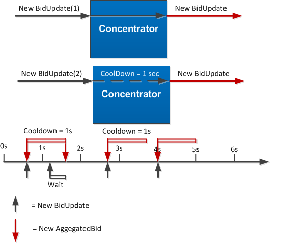

# Events & Scheduling

In [Device Agent Bids](Bids.md) you've learned that new Bids often originate due to a change in the state of the Device. Bids in essence are events that ripple through the system. 

# A hybrid System

***

The PowerMatcher is an **event driven system** but it can also turn into a **scheduling system**. 

A full event driven system is a system where a BidUpdate towards another Agent would automatically activate that Agent to do something with it immediately and generate a new event/ or update immediately. The advantage of such a system is that the whole system will respond to even a minor change; so if a Device Agent updates his status it will receive a priceUpdate that has processed his latest BidUpdate, relatively fast. The downside of a full event driven system; especially with a lot of agents, is that each individual event will kickstart the system and cause a shockwave.

The other extreme, a fully scheduled system is a system where agents don't react immediately on every new event but wait a while possibly receiving more events in the mean time and send a new update at a scheduled time. A sort of filter system. The advantage is that we don't create an oversensitive system viable to shockwaves. However the downside is that device agents could potentially have to wait for quite a long time before receiving a PriceUpdate that has processed their BidUpdate.

That's why we have created a hybrid system; a system that is normally an event driven system, but when a particular agent starts to get really busy it will naturally start to schedule by itself. 

----------------------

Lets look at when a BidUpdate reaches a Concentrator:



**Figure 1 - CoolDown Period**

We have implemented a **CoolDown** period after an Agent has sent an AggregatedBid. So what effectively happens is that when an Agent (Concentrator/Auctioneer) is not very busy it will immediately process the bid and generate an event on its own; when things start to get really busy it will wait for some other messages to arrive and take those into account before generating its own event. Cooldown periods don't have to be long; think in the order of one second. 

## The Technical Implementation

A Device Agent can choose to update his bid at any point in time depending on the state of the device. For example if the Freezer just heated up because somebody opened it; it will send out a new bid asking for more energy. To get a new bid from a Device Agent to the receiving Agent we have to go through several call functions (since we are passing through multiple abstractions):

The [Freezer example](https://github.com/flexiblepower/powermatcher/blob/master/net.powermatcher.examples/src/net/powermatcher/examples/Freezer.java)  will initiate a `doBidUpdate()`:

```
    void doBidUpdate() {
        if (isInitialized()) {
            double demand = minimumDemand + (maximumDemand - minimumDemand)
                            * generator.nextDouble();

            publishBid(new PointBid.Builder(getMarketBasis()).add(getMarketBasis().getMinimumPrice(), demand)
                                                             .add(getMarketBasis().getMaximumPrice(), minimumDemand)
                                                             .build());
        }
```

This will call the function `publishBid()` in the [BaseAgentEndpoint](https://github.com/flexiblepower/powermatcher/blob/master/net.powermatcher.core/src/net/powermatcher/core/BaseAgentEndpoint.java):

```
    protected final BidUpdate publishBid(Bid newBid) {
        Session session = getSession();

        if (isInitialized()) {
            if (lastBidUpdate != null && newBid.equals(lastBidUpdate.getBid())) {
                // This bid is equal to the previous bid, we should not send an update
                return lastBidUpdate;
            }
            BidUpdate update = new BidUpdate(newBid, **bidNumberGenerator.incrementAndGet()**);
            lastBidUpdate = update;
            publishEvent(new OutgoingBidEvent(getClusterId(),
                                              getAgentId(),
                                              session.getSessionId(),
                                              now(),
                                              update));
            LOGGER.debug("Sending bid [{}] to {}", update, session.getAgentId());
            session.updateBid(update);
            return update;
        } else {
            return null;
        }
    }
```

This BidUpdate will be received at the [BaseMatcherEndpoint](https://github.com/flexiblepower/powermatcher/blob/master/net.powermatcher.core/src/net/powermatcher/core/BaseMatcherEndpoint.java) in `handleBidUpdate()`; and this is where it start to get **important**:

```
    @Override
    public void handleBidUpdate(Session session, BidUpdate bidUpdate) {
        if (session == null ](]( !sessions.containsKey(session.getAgentId())) {
            throw new IllegalStateException("No session found");
        }

        if (bidUpdate == null ](]( !bidUpdate.getBid().getMarketBasis().equals(getMarketBasis())) {
            throw new InvalidParameterException("Marketbasis new bid differs from marketbasis auctioneer");
        }

        // Update agent in aggregatedBids
        bidCache.updateAgentBid(session.getAgentId(), bidUpdate);

        LOGGER.debug("Received from session [{}] bid update [{}] ", session.getSessionId(), bidUpdate);

        publishEvent(new IncomingBidEvent(session.getClusterId(),
                                          getAgentId(),
                                          session.getSessionId(),
                                          context.currentTime(),
                                          session.getAgentId(),
                                          bidUpdate));

        synchronized (bidUpdateCommand) {
            if (!bidUpdateScheduled) {
                long waitTime = coolDownEnds - context.currentTimeMillis();
                if (waitTime > 0) {
                    // We're in the cooldown period
                    context.schedule(bidUpdateCommand, Measure.valueOf(waitTime, SI.MILLI(SI.SECOND)));
                } else {
                    // Not in a cooldown period, do it right away!
                    context.submit(bidUpdateCommand);
                }
                bidUpdateScheduled = true;
            }
        }
    }
```

You can see that the function `handleBidUpdate()` creates a new runnable `bidUpdateCommand`, this bidUpdateCommand is executed immediately IF the receiving agent is no longer in its **CoolDown** period. When a new bidUpdate arrives while being in the cooldown period it will **schedule** a new Event for when the cooldown period finishes; this is exactly equal to the waittime: 

`context.schedule(bidUpdateCommand, Measure.valueOf(waitTime, SI.MILLI(SI.SECOND)));`

The bidUpdateCommand kicks of a `perfomUpdate()` which can vary depending on the type of Agent. For a Concentrator it will mean that it will aggregate its Bids and it will publish a new BidUpdate; the Auctioneer, however, will aggregate its Bids and publish a new PriceUpdate:

```
    private final Runnable bidUpdateCommand = new Runnable() {
        @Override
        public void run() {
            try {
                if (isInitialized()) {
                    performUpdate(bidCache.aggregate());
                }

                synchronized (this) {
                    bidUpdateScheduled = false;
                    coolDownEnds = context.currentTimeMillis() + minTimeBetweenUpdates;
                }
            } catch (RuntimeException e) {
                LOGGER.error("doBidUpate failed for matcher " + getAgentId(), e);
            }
        }
    };
```
So what effectively happens is that when an Agent (Concentrator/Auctioneer) is not very busy it will immediately process the bid and generate an event on its own; when things start to get really busy it will wait for some other messages to arrive and take those into account before generating its own event. Cooldown periods don't have to be long; think in the order of one second.

----------------------------------
In an earlier version of the PowerMatcher we learned that oscillative behaviour could occur; to solve this problem we introduced bidNumbers. So each bid has a unique ID and each Agent can lookup the correct bid when receiving a priceUpdate. For more detailed information please turn to the [Oscillation](https://github.com/flexiblepower/powermatcher/wiki/Oscillation) section. 

