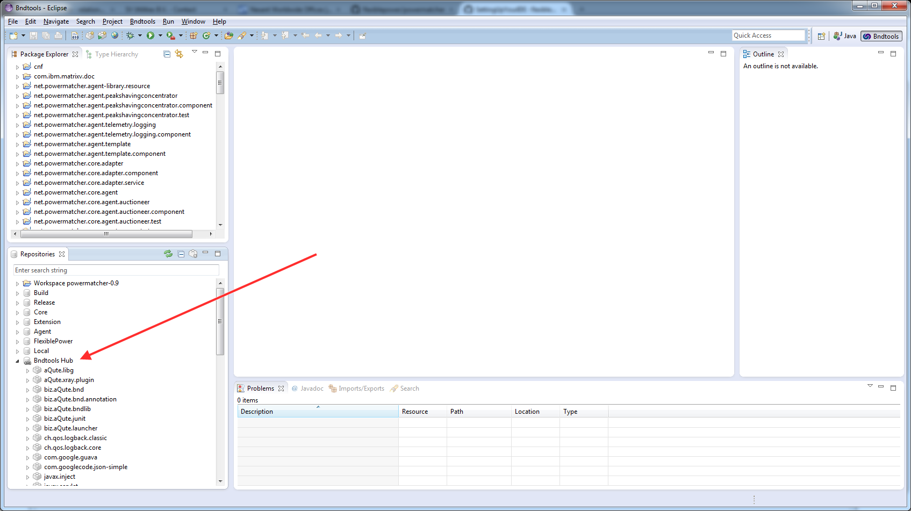

**Q:** My cloned (unchanged) workspace does not build. Eclipse reports build errors.

**A:** The workspace has references to external bundles. This is all taken care of by bnd tools, all the needed external bundles downloaded by bnd tools are stored in the user home directory. I experienced some problems on my work computer: eclipse/bndtools did not have write permissions im my windows home directory so the files were not saved.

Check the Bndtools Hub in the repository view (image below) to see if the external bundles have been downloaded. If Bndtools Hub is empty there is a problem downloading or saving the files.   

Changing the eclipse home directory solved this problem for me. Add the following line to your eclipse.ini -Duser.home=c:\eclipse\home to change the home directory used by eclipse.

***

