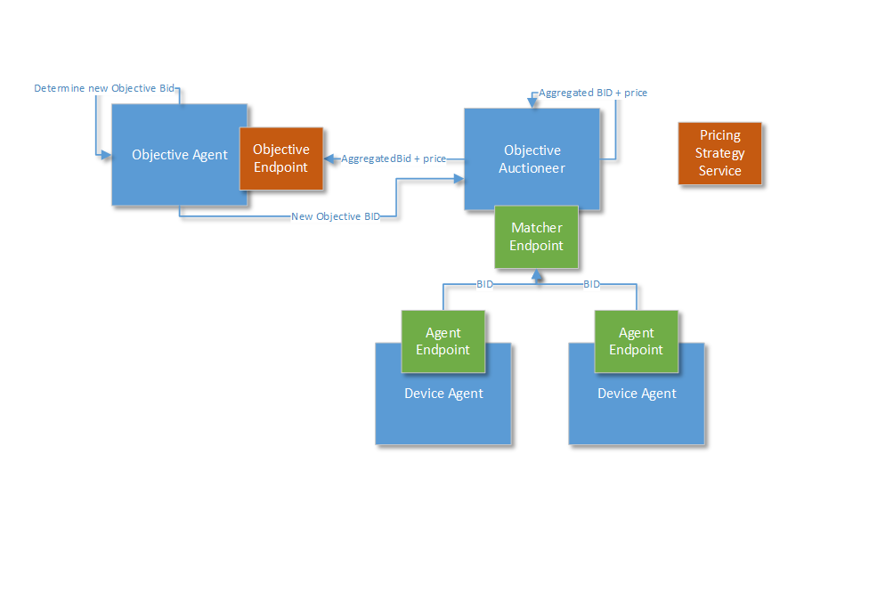

The Objective Agent interfaces with the business logic of an external application on one side; and with the PowerMatcher on the other side. 

For example, if you want the PowerMatcher cluster to serve as a Virtual Power Plant (VPP) and follow a quaterly (15 min) setpoint. It could be that you want your VPP NOT to balance itself but instead have it produce or consume **a surplus** amount of energy. This means you have to push the PowerMatcher market out of balance and thus NOT forward the Equilibrium price, instead *manipulate* the price in the PowerMatcher market. This can be done using the Objective Agent.

This is just one example for using the Objective Agent.

---------------------------------------------------------------

# Objective Agent and the ObjectiveAuctioneer



**Figure 1 - Objective agent**

The PowerMatcher core contains a special agent called the ObjectiveAgent. In addition the PowerMatcher core contains a class [[ObjectiveAuctioneer|https://github.com/flexiblepower/powermatcher/blob/master/net.powermatcher.core/src/net/powermatcher/core/auctioneer/ObjectiveAuctioneer.java]]. The ObjectiveAgent is used in combination with the ObjectiveAuctioneer.

The ObjectiveAuctioneer does not have the same purpose as the normal Auctioneer: it will only determine the equilibrium price. It will leave Aggregation to the ObjectiveAgent. The ObjectiveAuctioneer will send the unaffected AggregatedBid to to ObjectiveAgent where it will be manipulated. The affected AggregatedBid will be returned to the ObjectiveAuctioneer where it will determine the new equilibrium price. This will be sent to the Device Agents and the ObjectiveAgent.

# Technical Implementation

The ObjectiveAgent has an interface ObjectiveEndpoint which will add two methods notifyPriceUpdate(Price) and handleAggregatedBid(Bid). 

```
public interface ObjectiveEndpoint {

    /**
     * This method is called by the Auctioneer when it will send the price
     *
     * @param price
     *            the {@link Price} sent by the Auctioneer.
     */
    void notifyPrice(Price price);

    /**
     * This method will calculate a new Aggregated {@link Bid} to manipulate the cluster.
     *
     * @param aggregatedBid
     *            the Auctioneer's aggregated {@link Bid} that will be used to calculate the new {@link Bid}.
     * @return the updated {@link Bid}
     */
    Bid handleAggregateBid(Bid aggregatedBid);
}
```

When `ObjectiveAuctioneer's` method `performUpdate()` is called it will first send the `AggregatedBid` to the `ObjectiveAgent`: `ep.handleAggregatedBid()`:

```
    @Override
    protected void performUpdate(AggregatedBid aggregatedBid) {
        ObjectiveEndpoint ep = objectiveEndpoint;
        if (ep != null) {
            Bid bid = ep.handleAggregateBid(aggregatedBid);
            Price price = bid.calculateIntersection(0);
            ep.notifyPrice(price);
            publishPrice(price, aggregatedBid);
        } else {
            super.performUpdate(aggregatedBid);
        }
    }
```
 
The ObjectiveAgent will determines his objective Bid, manipulates the AggregatedBid and returns it to the ObjectiveAuctioneer. (See Example [[ObjectiveAgent|https://github.com/flexiblepower/powermatcher/blob/master/net.powermatcher.examples/src/net/powermatcher/examples/ObjectiveAgent.java]])

```
    @Override
    public Bid handleAggregateBid(Bid aggregatedBid) {

        // Option to do something with aggregatedBid to determine the objectiveBid  
        MarketBasis marketBasis = new MarketBasis(COMMODITY_ELECTRICITY,
                                                  CURRENCY_EUR, 5, -1.0d, 7.0d);
        double[] demand = new double[] { 100.0d, 50.0d, 50.0d, 0.0d, 0.0d };

        ArrayBid objectiveBid = new ArrayBid(marketBasis, demand);

        // Manipulate the aggregatedBid
        ArrayBid aggregatedObjectiveBid = objectiveBid.aggregate(aggregatedBid);

        LOGGER.info("ObjectiveAgent: new aggregated bid: [{}] ",
                    aggregatedObjectiveBid.getDemand());
        return aggregatedObjectiveBid;
    }
```

The ObjectiveAuctioneer will determine the equilibrium price and send a priceUpdate to the Device Agents using `publishPrice()`, in addition it will notify the ObjectiveAgent of the new Price `notifyPrice()`. 

```
    @Override
    protected void performUpdate(AggregatedBid aggregatedBid) {
        ObjectiveEndpoint ep = objectiveEndpoint;
        if (ep != null) {
            Bid bid = ep.handleAggregateBid(aggregatedBid);
            Price price = bid.calculateIntersection(0);
            ep.notifyPrice(price);
            publishPrice(price, aggregatedBid);
        } else {
            super.performUpdate(aggregatedBid);
        }
    }
```

-----------------

Got [[Overview Core Components|CoreComponents]] to get an overview of all classes in the Core.