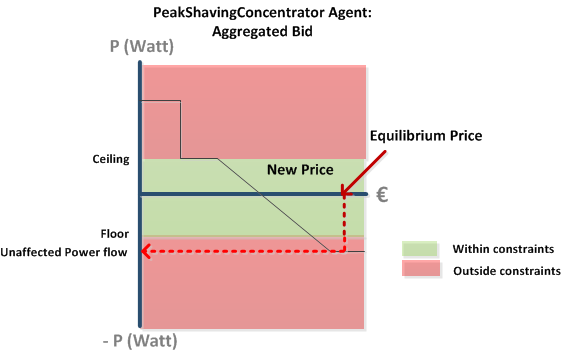
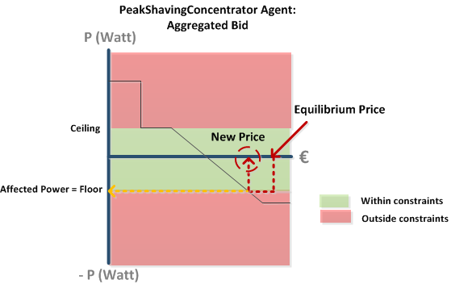

# Peak Shaving

PeakShaving is the capability of the PowerMatcher to make sure transformers or cables in the physical world are not over-exerted.

The PeakShavingConcentrator extends the normal Concentrator and has some additional functionality: it can Peak Shave!

# Peak Shaving Concentrator

PeakShaving is done by setting a Ceiling and Floor bandwidth, which indicates the maximum Power flow that is allowed over that node. In real life a concentrator can represent a cable or transformer and can thus be alleviated of high stress by setting limits in the virtual world.

Let's assume our earlier Aggregated Bid as shown in [Aggregation](Aggregation):


**Figure 1: Aggregated Bid @ PeakShavingConcentrator**
 
This Bid is the current state of that Concentrator, but now it receives an Equilibrium price from the Auctioneer which is very high! This Equilibrium price would result in a net power flow that lies in the red "outside constraints" region. See Figure 2:



**Figure 2: Equilibrium Price results in Powerflow outside constraints  @ PeakShavingConcentrator**

Instead, the PeakShavingConcentrator takes the Equilibrium Price, finds the **New Price** that stays within constraints and forwards this manipulated price to its Device Agents: the Freezer and Battery. The sub cluster produces a net demand that is equal to the Floor limit. See Figure 3:



**Figure 3: Peakshaved Bid @ PeakShavingConcentrator**

# Technical Implementation

The [PeakShaving Concentrator](https://github.com/flexiblepower/powermatcher/blob/master/net.powermatcher.peakshaving/src/net/powermatcher/peakshaving/PeakShavingConcentrator.java) extends [Concentrator](https://github.com/flexiblepower/powermatcher/blob/master/net.powermatcher.core/src/net/powermatcher/core/concentrator/Concentrator.java).

In the Config Admin you can set the static `floor` and `ceiling` of the PeakShaving Concentrator:

```
    protected double floor = -Double.MAX_VALUE;

    protected double ceiling = Double.MAX_VALUE;
```

When an Event is scheduled by the Runnable and executes `performUpdate()` (see below), it wil first call `transformBid()` before publishing the BidUpdate. 

```
    private final BaseMatcherEndpoint matcherPart = new BaseMatcherEndpoint() {
        @Override
        protected void performUpdate(AggregatedBid aggregatedBid) {
            Bid bid = transformBid(aggregatedBid);
            BidUpdate bidUpdate = publishBid(bid);
            saveBid(aggregatedBid, bidUpdate);
        };
    };
```
By comparing the Measured Power Demand at the actual real world Transformer with the Power Demanded by the Concentrator's Device Agents we first determine the difference: `getUncontrolledFlow()` returns the difference between this measured Power at the Transformer and the supposed Power Demand in the virtual world. This difference with the real world measurement is added to the bid in `bid.transpose()`. Consequently, in `clip()` the Bid is clipped according to `floor` and `ceiling` values.  

```
    @Override
    protected Bid transformBid(Bid aggregatedBid) {
        ArrayBid bid = aggregatedBid.toArrayBid();
        double uncontrolledFlow = getUncontrolledFlow();

        if (!Double.isNaN(uncontrolledFlow)) {
            bid = bid.transpose(uncontrolledFlow);
        }
        bid = clip(bid);
        if (!Double.isNaN(uncontrolledFlow)) {
            bid = bid.transpose(-uncontrolledFlow);
        }

        return bid;
    }
```

Likewise when a priceUpdate is received, the Price, is first manipulated in `transformPrice()`, see Figure 3, before it is published to its child Agents:

```
    @Override
    protected Price transformPrice(Price price, SentBidInformation info) {
        // Find the transformedBid that has the same bidnumber as the bid
        Bid originalBid = info.getOriginalBid();
        Bid transformedBid = info.getSentBid();

        PriceStep priceStep = price.toPriceStep();
        double transformedDemand = transformedBid.getDemandAt(priceStep);
        double realDemand = originalBid.getDemandAt(priceStep);

        if (transformedDemand < realDemand) {
            // Increase the price step until this is no longer true
            while (transformedDemand < realDemand && !priceStep.isMaximum()) {
                priceStep = priceStep.increment();
                realDemand = originalBid.getDemandAt(priceStep);
            }
        } else if (transformedDemand > realDemand) {
            // Decrease the price step until this is no longer true
            while (transformedDemand > realDemand && !priceStep.isMinimum()) {
                priceStep = priceStep.decrement();
                realDemand = originalBid.getDemandAt(priceStep);
            }
        }

        allocatedFlow = originalBid.getDemandAt(priceStep);

        return priceStep.toPrice();
    }
```
