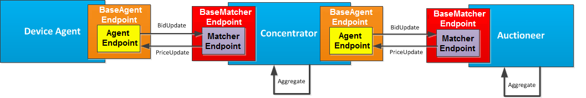

In the previous section [[PowerMatcher Core|https://github.com/flexiblepower/powermatcher/wiki/PowerMatcher-Core]] we laid down the foundation of the Core components: the Agents. This section elaborates on the Interfaces that were defined for communication...

--------------------------

The connections between the agents are realized through AgentEndpoints and MatcherEndpoints (Interfaces).

* An [[AgentEndPoint|https://github.com/flexiblepower/powermatcher/blob/master/net.powermatcher.api/src/net/powermatcher/api/AgentEndpoint.java]] can **receive Prices**.
* A  [[MatcherEndPoint|https://github.com/flexiblepower/powermatcher/blob/master/net.powermatcher.api/src/net/powermatcher/api/MatcherEndpoint.java]] can **receive Bids** 

Both EndPoints extend the [[Agent|https://github.com/flexiblepower/powermatcher/blob/master/net.powermatcher.api/src/net/powermatcher/api/Agent.java]] Interface which allows for getting some basic Agent information.

An Auctioneer will always implement the interface: a MatcherEndpoint, the Concentrator will implement an AgentEndpoint and a MatcherEndpoint. A DeviceAgent will implement an AgentEndpoint. As you may have noticed, the Concentrator has two Endpoints. If you like; the Concentrator is both female and male :). Figure 1 shows the connections between the agents. 

**Figure 1 - Connection of Agents**

In order to make the functionality of the Auctioneer and Concentrator as clean as possible we have put generic handling of messages, Bid and Price Updates, in seperate classes: The `BaseMatcherEndpoint` and the `BaseAgentEndpoint`.

The class that handles all messages that go through the MatcherEndpoint we have called the [[BaseMatcherEndpoint|https://github.com/flexiblepower/powermatcher/blob/master/net.powermatcher.core/src/net/powermatcher/core/BaseMatcherEndpoint.java]]

* This class handles connection and disconnection of a [[Session|Session]] 
* This class makes sure that when an Agent calls `publishPrice()` it is distributed to every child agent
* This class makes sure that when a new BidUpdate arrives in `handleBidUpdate()` it is updated in the `BidCache`
* This class makes sure that a new BidUpdate results in a new AggregatedBid unless the Agent is still in the cooldown period: see [[Events & Scheduling|Events & Scheduling]]
 
The class that handles all messages that go through the AgentEndpoint we have called the [[BaseAgentEndpoint|https://github.com/flexiblepower/powermatcher/blob/master/net.powermatcher.core/src/net/powermatcher/core/BaseAgentEndpoint.java]]

* This class makes sure that when an Agent generates a new Bid , the BaseAgentPoint turns the bid into a message BidUpdate and makes sure the BidUpdate has a unique bidNumber ([[see Oscillation|Oscillation]]).
* This class will handle a priceUpdate

----------------------------

Agents don't communicate directly but through [[Sessions|Session]].
