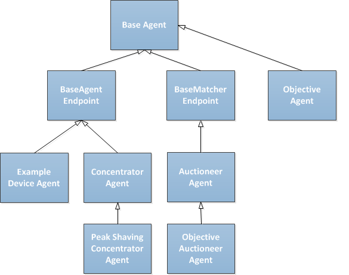

In the previous section [Architecture](Architecture-PowerMatcher) you've learned about our different Agents. This chapter delves deeper in how the Agents were implemented technically.

### Package: [net.powermatcher.core](https://github.com/flexiblepower/powermatcher/tree/master/net.powermatcher.core)
***
# Agents
The Inheritence and foundation of all Agents is depicted in Figure 1:

**Figure 1 - Inheritence**

* The [BaseAgent](https://github.com/flexiblepower/powermatcher/blob/master/net.powermatcher.core/src/net/powermatcher/core/BaseAgent.java) abstract class contains some ID-information like agentId, clusterId etc.
* The [BaseAgentEndpoint](https://github.com/flexiblepower/powermatcher/blob/master/net.powermatcher.core/src/net/powermatcher/core/BaseAgentEndpoint.java) extends the BaseAgent and contains some generic handling for sending BidUpdates and receiving PriceUpdates.
* The [BaseMatcherEndpoint](https://github.com/flexiblepower/powermatcher/blob/master/net.powermatcher.core/src/net/powermatcher/core/BaseMatcherEndpoint.java) extends the BaseAgent and contains some generic handling for receiving BidUpdates and sending PriceUpdates.
* The [Example Device Agents](https://github.com/flexiblepower/powermatcher/blob/master/net.powermatcher.examples/src/net/powermatcher/examples/Freezer.java) is an example implementation of an Agent that can send BidUpdates and receive PriceUpdates.
* The [Concentrator](https://github.com/flexiblepower/powermatcher/blob/master/net.powermatcher.core/src/net/powermatcher/core/concentrator/Concentrator.java) can **aggregate Bids** and forward a single Bid upwards as well as receive prices and send downwards.
* The PeakShavingConcentrator extends the Concentrator but can also **impose limits** on the maximum amount of Power.
* The [Auctioneer](https://github.com/flexiblepower/powermatcher/blob/master/net.powermatcher.core/src/net/powermatcher/core/auctioneer/Auctioneer.java) defines the market, can **aggregate Bids** and determine the **Equilibrium Price**.
* The [Objective Agent](https://github.com/flexiblepower/powermatcher/blob/master/net.powermatcher.examples/src/net/powermatcher/examples/ObjectiveAgent.java) can send **Objectives**.

----------------------------------

The section [Device Agent Bids](Bids.md) explains the basic functionality of a Device Agent.

The section [Aggregation](](Aggregation.md) explains about Bid Aggregation.

The section [Peak Shaving](PeakShaving.md) explains how the PowerMatcher can tackle grid congestion.

The section [Equilibrium Price](Equilibrium.md) explains how the Auctioneer balances the market. 

The section [Cluster Objectives](Objective.md explains how the PowerMatcher can receive Objectives.

