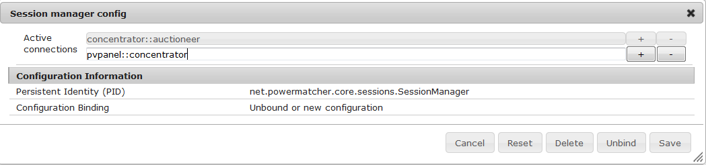
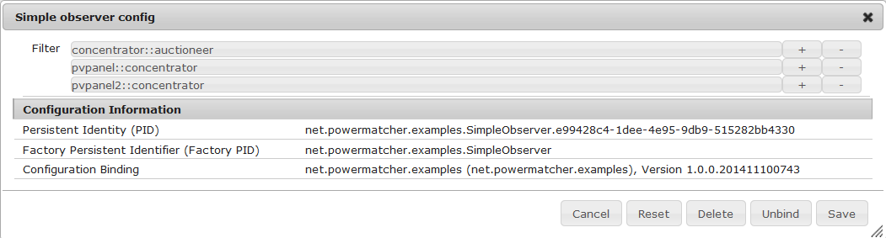

# Creating a simple PM cluster

## Overview

In this part of the tutorial, we will creating two simple PM clusters. Our first cluster will have an Auctioneer, a Concentrator and one pvpanel (photovoltaic panel). Once that cluster is up and running, we will add a second pvpanel to this running cluster.


## Starting up Powermatcher in OSGI

The powermatcher repository has an `examples` bundle, containing example implemantations of the core and API classes and interfaces. In this example, out device agent will be PVPanel class. More information on how to build your own device agent can be found in the [Creation of a device agent](CreationOfDeviceAgent) section.

In eclipse, open `examples.bndrun` in the `net.powermatcher.examples` project. Click on `Run OSGi` to fire up the felix.


Felix will start logging to the eclipse console. When `[INFO] Started Jetty ... at port(s) HTTP:8080 on context path /` appears, the webconsole is loaded and ready for use. Open your favourite webbrowser and go to [http://localhost:8080/system/console/components](http://localhost:8080/system/console/components) 


In this example, we will be using the `Auctioneer`, `Concentrator`, `PVPanel` and `SessionManager` bundles. As you can see, they are all either `registered `or `unsatified`. After the configuration, they all have an `active` status.

## Configuring powermatcher

In the menu, select OSGi -> configuration to open the configuration manager. Here, we will create an `Auctioneer`, a `Concentrator` and a `PVPanel` instance. Then we use the Session manager to link them all together.


### Configuring the Auctioneer

Click on the + button at the end of the `Auctioneer config` line to create a new auctioneer. You will get a pop-up with configuration values. You can keep all default values, except for the `Price update rate`, we will change that to `10` seconds to get more output. Click save to create the instance.


### Configuring the Concentrator and the PVPanel

A `Concentrator` and `PVPanel` instance are created in the same way. Keep the default values, except for `Price update rate`, which will be set to `10` seconds in both cases.


***


### Linking everything together with the session manager

The session manager holds a list of all active connections. To add lines, click on the edit button on the `Session manager config` line. An `AgentRole` and a `MatcherRole` are linked with the template `AgentRole::MatcherRole`.

An `Auctioneer` is a `MatcherRole` and the `Concentrator` has an `AgentRole` towards the `Auctioneer`:

```
concentrator::auctioneer
```

When you entered this line, click on the + button to add another session. The `Concentrator` has a `MatcherRole` towards the `PVPanel`:

```
pvpanel::concentrator
```

Click save to save the configuration. All 3 components will now be linked in sessions.



## interpreting the powermatcher log

In console view in eclipse, powermatcher and felix will log transactions.

The first output by Powermatcher will be to log the activation of the instances and then the creation of the 2 sessions.

```
INFO  n.powermatcher.examples.PVPanelAgent - Agent [pvpanel], activated
INFO  n.p.core.concentrator.Concentrator - Agent [concentrator], activated
...
INFO  n.p.core.sessions.SessionManager - Connecting session: [concentrator::auctioneer]
INFO  n.p.core.auctioneer.Auctioneer - Agent connected with session [concentrator::auctioneer]
INFO  n.p.core.sessions.SessionManager - Connecting session: [pvpanel::concentrator]
INFO  n.p.core.concentrator.Concentrator - Agent connected with session [pvpanel::concentrator]
```

Every 10 seconds, powermatcher will log transactions. We will go over them, line by line:

```
DEBUG n.powermatcher.examples.PVPanelAgent - updateBid(Bid{bidNumber=0, PricePoint[]{(0,-7E2)}, MarketBasis{commodity=electricity, currency=EUR, minimumPrice=0, maximumPrice=1, priceSteps=100}})
```
The `pvpanel` sends a bid to the `concentrator`. The bid contains an id, a PricePoint Array and the Marketbasis
```
INFO  n.p.core.concentrator.Concentrator - Received bid update [Bid{bidNumber=0, PricePoint[]{(0,-7E2)}, MarketBasis{commodity=electricity, currency=EUR, minimumPrice=0, maximumPrice=1, priceSteps=100}}] from session [pvpanel::concentrator]
```
The `concentrator` receives the bid because they are linked by the session `pvpanel::concentrator`
```
DEBUG n.p.core.concentrator.Concentrator - Updating aggregated bid [Bid{bidNumber=0, demand[]{-7E2,-7E2,-7E2,-7E2,-7E2,-7E2,-7E2,-7E2,-7E2,-7E2,-7E2,-7E2,-7E2,-7E2,-7E2,-7E2,-7E2,-7E2,-7E2,-7E2,-7E2,-7E2,-7E2,-7E2,-7E2,-7E2,-7E2,-7E2,-7E2,-7E2,-7E2,-7E2,-7E2,-7E2,-7E2,-7E2,-7E2,-7E2,-7E2,-7E2,-7E2,-7E2,-7E2,-7E2,-7E2,-7E2,-7E2,-7E2,-7E2,-7E2,-7E2,-7E2,-7E2,-7E2,-7E2,-7E2,-7E2,-7E2,-7E2,-7E2,-7E2,-7E2,-7E2,-7E2,-7E2,-7E2,-7E2,-7E2,-7E2,-7E2,-7E2,-7E2,-7E2,-7E2,-7E2,-7E2,-7E2,-7E2,-7E2,-7E2,-7E2,-7E2,-7E2,-7E2,-7E2,-7E2,-7E2,-7E2,-7E2,-7E2,-7E2,-7E2,-7E2,-7E2,-7E2,-7E2,-7E2,-7E2,-7E2,-7E2}, MarketBasis{commodity=electricity, currency=EUR, minimumPrice=0, maximumPrice=1, priceSteps=100}}]
```
The `concentrator` aggregates the bids and sends it to the `auctioneer`. The aggregated bid contains a demandArray and the marketbasis.
```
DEBUG n.p.core.auctioneer.Auctioneer - Received bid update [Bid{bidNumber=0, demand[]{-7E2,-7E2,-7E2,-7E2,-7E2,-7E2,-7E2,-7E2,-7E2,-7E2,-7E2,-7E2,-7E2,-7E2,-7E2,-7E2,-7E2,-7E2,-7E2,-7E2,-7E2,-7E2,-7E2,-7E2,-7E2,-7E2,-7E2,-7E2,-7E2,-7E2,-7E2,-7E2,-7E2,-7E2,-7E2,-7E2,-7E2,-7E2,-7E2,-7E2,-7E2,-7E2,-7E2,-7E2,-7E2,-7E2,-7E2,-7E2,-7E2,-7E2,-7E2,-7E2,-7E2,-7E2,-7E2,-7E2,-7E2,-7E2,-7E2,-7E2,-7E2,-7E2,-7E2,-7E2,-7E2,-7E2,-7E2,-7E2,-7E2,-7E2,-7E2,-7E2,-7E2,-7E2,-7E2,-7E2,-7E2,-7E2,-7E2,-7E2,-7E2,-7E2,-7E2,-7E2,-7E2,-7E2,-7E2,-7E2,-7E2,-7E2,-7E2,-7E2,-7E2,-7E2,-7E2,-7E2,-7E2,-7E2,-7E2,-7E2}, MarketBasis{commodity=electricity, currency=EUR, minimumPrice=0, maximumPrice=1, priceSteps=100}}] from session [concentrator::auctioneer]
```
The `auctioneer` receives the aggreagated bid from the `concentrator` through the `concentrator::auctioneer` session.
```
DEBUG n.p.core.auctioneer.Auctioneer - New price: Price{currentPrice=0}, session concentrator::auctioneer
```
The `auctionee`r creates a price, based on the aggregated bid.
```
DEBUG n.p.core.concentrator.Concentrator - Received price update [Price{currentPrice=0}]
```
The `concentrator` receives the price and sends it to the `pvpanel`.
```
DEBUG n.powermatcher.examples.PVPanelAgent - updatePrice(Price{currentPrice=0})
DEBUG n.powermatcher.examples.PVPanelAgent - Received price update [Price{currentPrice=0}]
```
The `pvpanel` recieves an updated price from the `concentrator` and notifies all of its observers

## Adding a second pvpanel

Adding a second PVPanel to our cluster is easy. Go back to the configuration manager and once again, click on the + button on the `PVPAnel config` line. This one will also have a timeout of 10 seconds, but it needs a different id. 2 instances cannot have the same id. We will name it `pvpanel2`.


Then all we have to do is add this new session to the session manager:

```
pvpanel2::concentrator
```



Now you have a cluster with 2 PVPanels