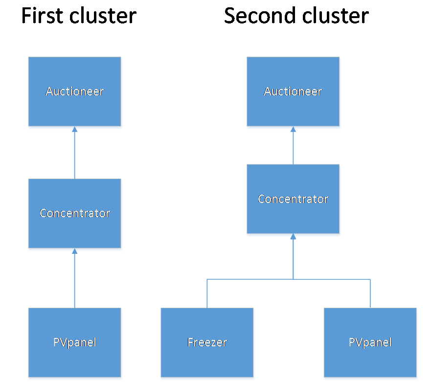
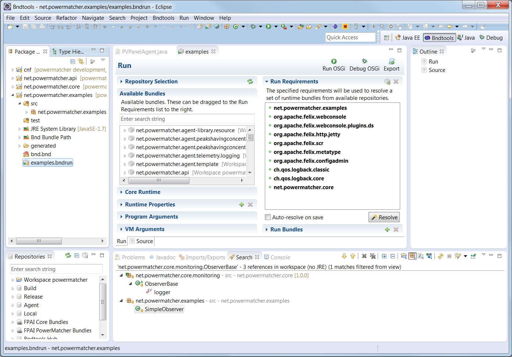
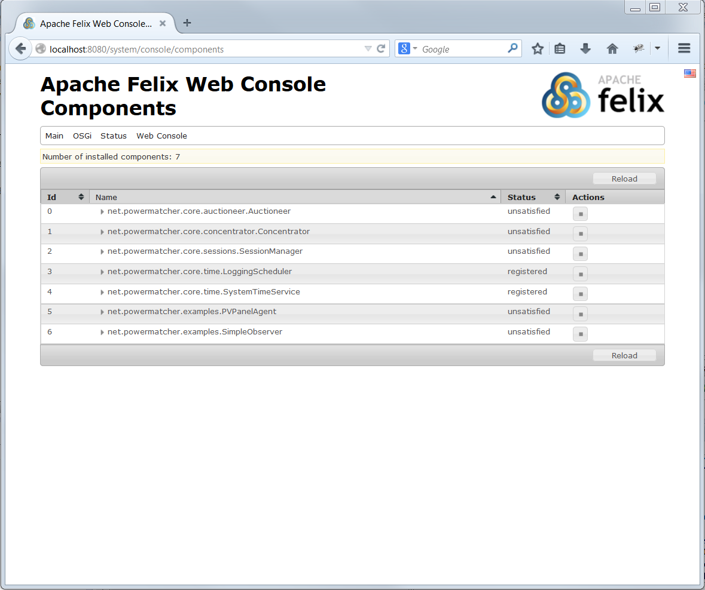
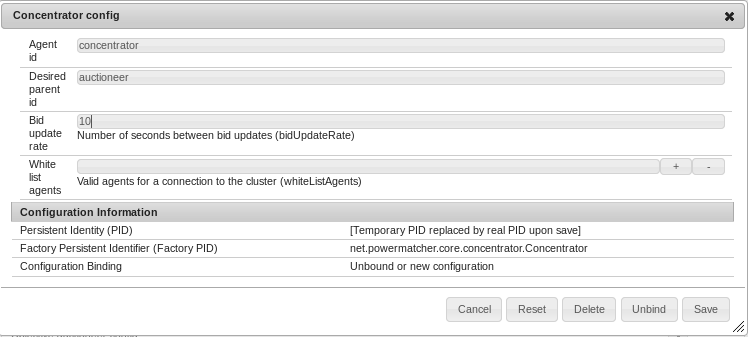
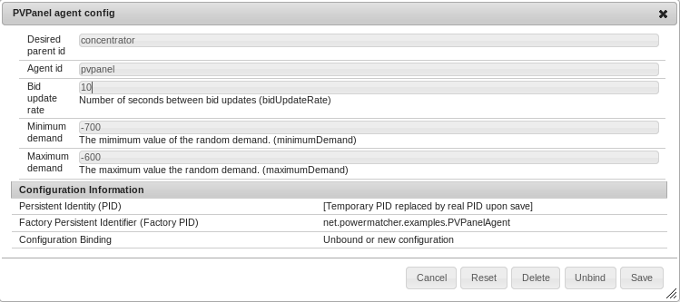
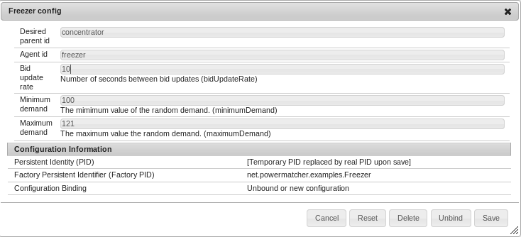

# Creating a simple PM cluster

In this part of the tutorial, we will be creating two simple PM clusters. Our first cluster will have an `Auctioneer`, a `Concentrator` and a `PVPanel` (photovoltaic panel). Once that cluster is up and running, we will add a Freezer to this cluster.



This session uses the configuration admin provided by the Felix web console. In the [Visualizer](Visualizer.md) section, we will use the PowerMatcher visualizer.

We will do this by following the following steps:

  1. Starting up the OSGI server
  2. Configure Actioneer
  3. Configure Concentrator
  4. Configure PVAgent

## Starting up PowerMatcher in OSGI

The PowerMatcher repository has an `examples` bundle, containing example implementations of the core and API classes and interfaces. In this example, our device agents will be the `PVPanel` and the `Freezer` classes. More information on how to build your own device agent can be found in the [Creation of a device agent](CreationOfDeviceAgent.md) section.

In eclipse, open `examples.bndrun` of the `net.PowerMatcher.examples` project. Click on `Run OSGi` to fire up the Apache Felix service.



Felix will start logging to the eclipse console. When `[INFO] Started Jetty ... at port(s) HTTP:8080 on context path /` appears, the webconsole has been loaded and is ready for use. Open your favourite web browser and go to [http://localhost:8080/system/console/components](http://localhost:8080/system/console/components) 

The default username and password are both: 'admin'



In this example, we will be using the `Auctioneer`, `Concentrator`, `PVPanel` and `Freezer` bundles. As you can see, they are all either `registered `or `unsatified`. After the configuration, they all have an `active` status.

## Configuring PowerMatcher

In the menu, select OSGi -> configuration to open the configuration manager. Here, we will create an `Auctioneer`, a `Concentrator` and a `PVPanel` instance. The SessionManager will link them all together for us. This is explained in the [Sessions](Session.md) section.


### Configuring the Auctioneer

Click on the + button at the end of the `Auctioneer config` line to create a new auctioneer. You will get a pop-up with configuration values. You can keep all default values, except for the `Price update rate`, we will change that to `10` seconds to get more output. Click save to create the instance.


### Configuring the Concentrator

A `Concentrator` instance is created in the same way as the `Concentrator`. Keep the default values, except for `Price update rate`, which will be set to `10` seconds.



### Configuring the PVPanel

A `PVPanel` instance are created in the same way as the `Concentrator` and the `Auctioneer`. Keep the default values, except for `Price update rate`, which will be set to `10` seconds.



## Interpreting the PowerMatcher log

In console view in eclipse, PowerMatcher and felix will log transactions.

The first output by PowerMatcher will be to log the activation of the instances and then the creation of the 2 sessions.

```
INFO  n.PowerMatcher.examples.PVPanelAgent - Agent [pvpanel], activated
INFO  n.p.core.concentrator.Concentrator - Agent [concentrator], activated
INFO  n.p.core.auctioneer.Auctioneer - Agent [auctioneer], activated
...
INFO  n.p.core.sessions.SessionManager - Added new wanted connection: [pvpanel:concentrator]
INFO  n.p.core.sessions.SessionManager - Added new wanted connection: [concentrator:auctioneer]
INFO  n.p.core.auctioneer.Auctioneer - Agent connected with session [concentrator:auctioneer]
INFO  n.p.core.concentrator.Concentrator - Agent connected with session [pvpanel:concentrator]
```

Every 10 seconds, PowerMatcher will log transactions. We will go over them, line by line:

```
DEBUG n.PowerMatcher.examples.PVPanelAgent - updateBid(PointBid{bidNumber=1, PricePoint[]{PricePoint{Price{priceValue=0}, demand = -628.4498098610256),PricePoint{Price{priceValue=1}, demand = -700.0)}, MarketBasis{commodity=electricity, currency=EUR, minimumPrice=0, maximumPrice=1, priceSteps=100}})
```
The `pvpanel` sends a PointBid to the `concentrator`. The bid contains the bidnumber, pricePointArray and the Marketbasis.
```
INFO  n.p.core.concentrator.Concentrator - Received from session [pvpanel:concentrator] bid update [PointBid{bidNumber=1, PricePoint[]{PricePoint{Price{priceValue=0}, demand = -628.4498098610256),PricePoint{Price{priceValue=1}, demand = -700.0)}, MarketBasis{commodity=electricity, currency=EUR, minimumPrice=0, maximumPrice=1, priceSteps=100}}] 
```
The `concentrator` receives the bid because they are linked by the session `pvpanel:concentrator`
```
DEBUG n.p.core.concentrator.Concentrator - Updating aggregated bid [ArrayBid{bidNumber=1, demand[]{-6.581E2,-6.585E2,-6.589E2,-6.593E2,-6.597E2,-6.602E2,-6.606E2,-6.61E2,-6.614E2,-6.619E2,-6.623E2,-6.627E2,-6.631E2,-6.636E2,-6.64E2,-6.644E2,-6.648E2,-6.653E2,-6.657E2,-6.661E2,-6.665E2,-6.67E2,-6.674E2,-6.678E2,-6.682E2,-6.686E2,-6.691E2,-6.695E2,-6.699E2,-6.703E2,-6.708E2,-6.712E2,-6.716E2,-6.72E2,-6.725E2,-6.729E2,-6.733E2,-6.737E2,-6.742E2,-6.746E2,-6.75E2,-6.754E2,-6.758E2,-6.763E2,-6.767E2,-6.771E2,-6.775E2,-6.78E2,-6.784E2,-6.788E2,-6.792E2,-6.797E2,-6.801E2,-6.805E2,-6.809E2,-6.814E2,-6.818E2,-6.822E2,-6.826E2,-6.831E2,-6.835E2,-6.839E2,-6.843E2,-6.847E2,-6.852E2,-6.856E2,-6.86E2,-6.864E2,-6.869E2,-6.873E2,-6.877E2,-6.881E2,-6.886E2,-6.89E2,-6.894E2,-6.898E2,-6.903E2,-6.907E2,-6.911E2,-6.915E2,-6.919E2,-6.924E2,-6.928E2,-6.932E2,-6.936E2,-6.941E2,-6.945E2,-6.949E2,-6.953E2,-6.958E2,-6.962E2,-6.966E2,-6.97E2,-6.975E2,-6.979E2,-6.983E2,-6.987E2,-6.992E2,-6.996E2,-7E2}, MarketBasis{commodity=electricity, currency=EUR, minimumPrice=0, maximumPrice=1, priceSteps=100}}]
```
The `concentrator` aggregates the bids and sends it to the `auctioneer`. The aggregated bid contains a bid number, a demandArray and the marketbasis.
```
DEBUG n.p.core.auctioneer.Auctioneer - Received from session [concentrator:auctioneer] bid update [ArrayBid{bidNumber=1, demand[]{-6.157E2,-6.165E2,-6.174E2,-6.182E2,-6.191E2,-6.199E2,-6.208E2,-6.217E2,-6.225E2,-6.234E2,-6.242E2,-6.251E2,-6.259E2,-6.268E2,-6.276E2,-6.285E2,-6.293E2,-6.302E2,-6.31E2,-6.319E2,-6.327E2,-6.336E2,-6.344E2,-6.353E2,-6.361E2,-6.37E2,-6.378E2,-6.387E2,-6.395E2,-6.404E2,-6.412E2,-6.421E2,-6.429E2,-6.438E2,-6.446E2,-6.455E2,-6.463E2,-6.472E2,-6.481E2,-6.489E2,-6.498E2,-6.506E2,-6.515E2,-6.523E2,-6.532E2,-6.54E2,-6.549E2,-6.557E2,-6.566E2,-6.574E2,-6.583E2,-6.591E2,-6.6E2,-6.608E2,-6.617E2,-6.625E2,-6.634E2,-6.642E2,-6.651E2,-6.659E2,-6.668E2,-6.676E2,-6.685E2,-6.693E2,-6.702E2,-6.71E2,-6.719E2,-6.727E2,-6.736E2,-6.745E2,-6.753E2,-6.762E2,-6.77E2,-6.779E2,-6.787E2,-6.796E2,-6.804E2,-6.813E2,-6.821E2,-6.83E2,-6.838E2,-6.847E2,-6.855E2,-6.864E2,-6.872E2,-6.881E2,-6.889E2,-6.898E2,-6.906E2,-6.915E2,-6.923E2,-6.932E2,-6.94E2,-6.949E2,-6.957E2,-6.966E2,-6.974E2,-6.983E2,-6.991E2,-7E2}, MarketBasis{commodity=electricity, currency=EUR, minimumPrice=0, maximumPrice=1, priceSteps=100}}] 
```
The `auctioneer` receives the aggreagated bid from the `concentrator` through the `concentrator::auctioneer` session.
```
DEBUG n.p.core.auctioneer.Auctioneer - New price: PriceUpdate [Price{priceValue=0}, bidNr=2], session concentrator:auctioneer
```
The `auctioneer` creates a price, based on the aggregated bid and wraps it in a PriceUpdate, with the bidnumber of the bid it was based on.
```
DEBUG n.p.core.concentrator.Concentrator - Received price update [PriceUpdate [Price{priceValue=0}, bidNr=3]]
```
The `concentrator` receives the PriceUpdate and sends it to the `pvpanel`.
```
DEBUG n.PowerMatcher.examples.PVPanelAgent - Received price update [PriceUpdate [Price{priceValue=0}, bidNr=6]], current bidNr = 7
```
The `pvpanel` recieves an updated price from the `concentrator` and notifies all of its observers

## Adding a second PVPanel

Adding a second PVPanel to our cluster is easy. Go back to the configuration manager and once again, click on the + button on the `Freezer config` line. This one will also have a timeout of 10 seconds. As usual, you can leave the rest of the defaults.


Then all we have to do is add this new session to the session manager:

Now you have a cluster with both a PvPanel and a Freezer as device Agents