# Using the Visualizer

In the [Simple PM Cluster](SimplePMCluster.md) section, we created a cluster using the Felix Configuration Admin. There was hardly any visual feedback, apart from the eclipse console output that told us the Agents were activated and that sessions had started. 
The Visualizer is a graphical shell on top of the Configuration Admin, with the addition of session visualization. You can use the visualizer and the Configuration Admin at the same time. Agents added in the Configuration Admin will be shown in the visualizer after a page refresh and visa versa. 

On this page, we will start up the visualizer, create the same cluster we created as last time and then add a new Agent Type to the menu and cluster.

## Using the visualizer

For this tutorial, we won't use the `examples.bndrun`. The PowerMatcher repository has an `net.PowerMatcher.visualisation` bundle, open the `visualisation.bndrun` file. Click on `Run OSGi` to fire up the Apache Felix service. Now go to [http://localhost:8080/system/console/configMgr](http://localhost:8080/system/console/configMgr) in your browser.

### Starting up

Click on the + button at the end of the `Visualisation plug-in config` line to create a new Visualisation servlet. You will get a pop-up with configuration fields. The visualisation plug-in only has one field:  `menu`. You can keep the default values for now. In the last section, the menu option will be explained. Click save to create the instance.

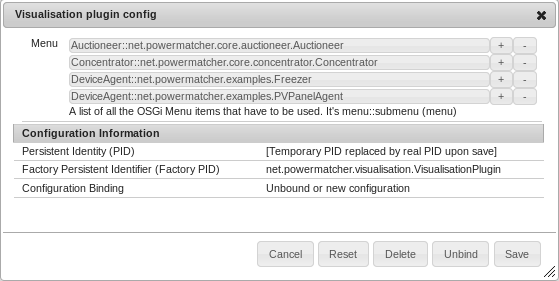

The Visualizer is now running. In the Felix menu, go to Main -> PowerMatcher cluster visualizer. 

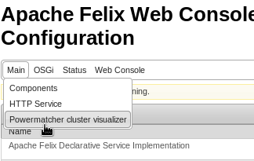

There won't be any active agents, so our cluster will be empty. You will only see the menu at the top and a blank canvas.

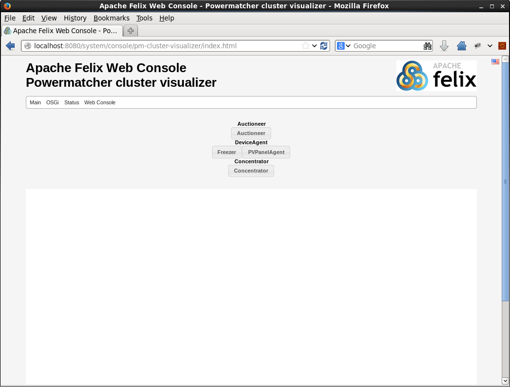

### Creating Agents

#### An Auctioneer

We are going to start building our cluster with an Auctioneer. If you click on the Auctioneer button in the menu, you will get a pop-up with the same fields as in the Configuration Admin. You can keep all default values, except for the `Price update rate`, we will change that to `10` seconds to get more output. Click `OK` to create the instance. 

The page will be reloaded and you will now have an auctioneer agent running in your cluster.

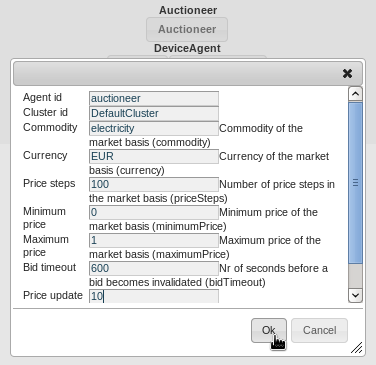

#### The rest

Next, create an Concentrator and a Freezer with the default settings. Then, create a PvPanel with `concentrator2` as its `Desired Parent Id`. It will cause this agent to not have an active session. When your done, your cluster will look like this.

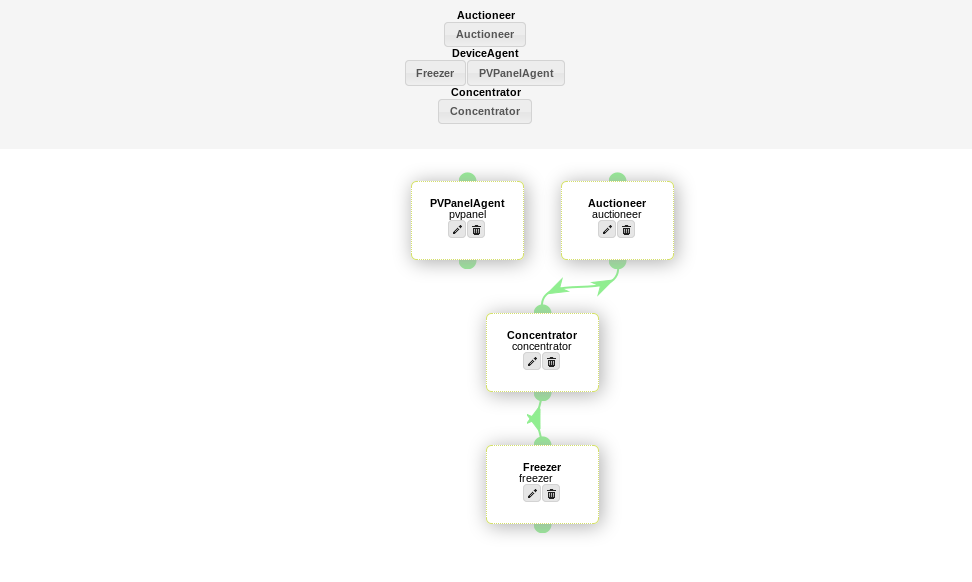

As you can see, the auctioneer and concentrator, and the concentrator and the freezer are connected by a session. The PvPanel's desired parent is not present in the cluster, so it's at the top level. The top level contains all Agents who either don't have a desired parent (like the Auctioneer) or whose desired parent is not active (yet).

### Modifying agents

All agents can be modified and deleted. As you can see, all nodes have a delete - and an edit button. 

Turns out we made a mistake and `pvpanel` needs `concentrator` as his desired parent. Click on the edit button of the `pvpanel`, a pop-up with the current values will appear. Change the Desired Parent Id to `concentrator` and click OK. 

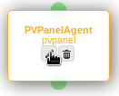

The page will once again be reloaded and now the `pvpanel` is in a session with `concentrator` and at the bottom level.

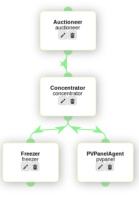

### Deleting Agents

We no longer need the freezer in our cluster, so it's time to delete it. Click on the delete button of `freezer` and conform the action. The `freezer` will now be gone.

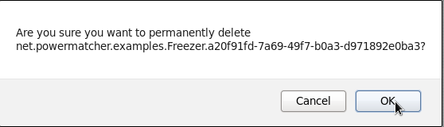

### Highlighting

The visualizer can highlight two things : one session and its agents, and all agents that are in a session with an agent. This feature can be useful in bigger cluster.

By hovering your mouse over a session line, the line and the two nodes are highlighted. 
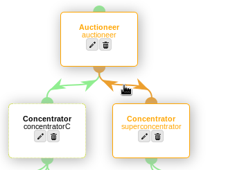

By hovering over the semi-circular connector at the bottom of a node, you highlight all its children. 


##  Editing the visualizer

You can add new agents to the Visualisation plug-in. To do this, go back to the config admin and click on the visualisation plug-in line to edit it. A menu line is formatted as 

```
menu-title::fpid-of-agent
```

In the [Creating a Device Agent](CreationOfDeviceAgent.md) section, we added a wind turbine, let's add it to this menu and put one in the cluster. So add the line

```
DeviceAgent::net.PowerMatcher.examples.WindTurbine
```
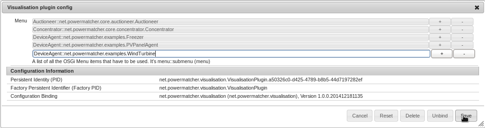

If you go back to the visualizer, you will now see a WindTurbine menu item under DeviceAgent. Click on it to create one, leave the default desired parent id to place it under concentrator.

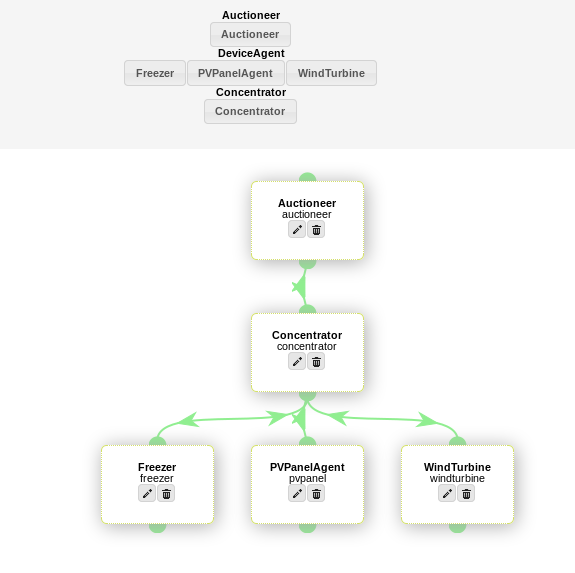