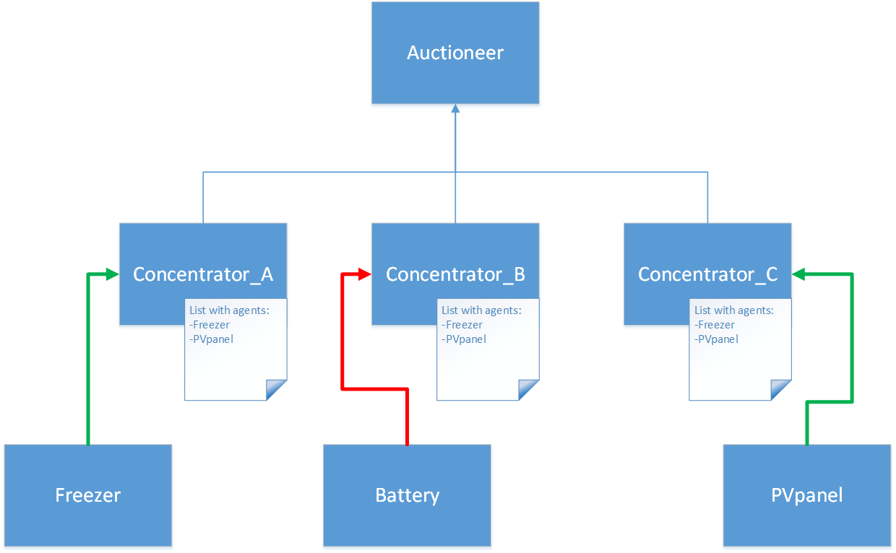
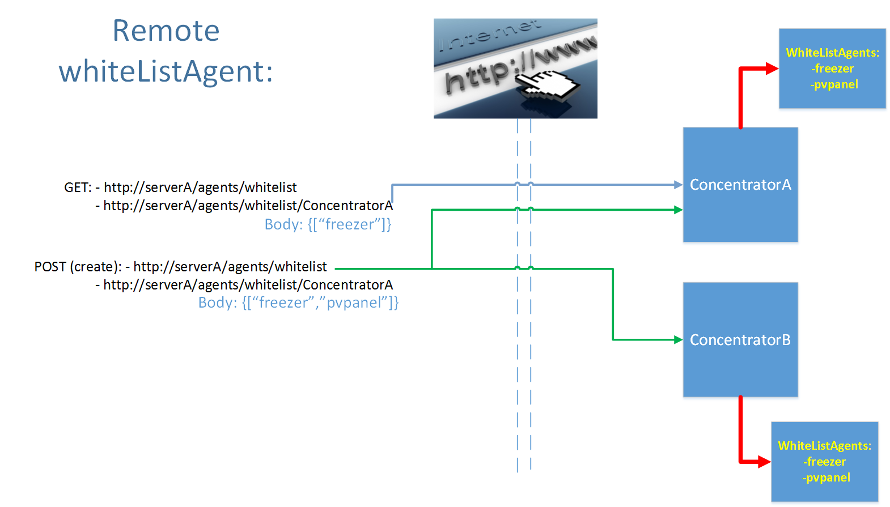

## PM Agent whitelist

On concentrator level, there is made some security for the powermatcher cluster.
Each concentrator has his own whitelist of agents. This whitelist holds the agentsId’s which are allowed to connect to the cluster through that concentrator. In the above picture you can see that concentrator A, B and C allows the connection for agent “Freezer” and “PVpanel”. Agent “Battery”  is not allowed to connect to the cluster. Thus Concentrator_B will not connect with agent “Battery”. With this implementation you can control the security of connections with particular agents.

### Project:  project net.powermatcher.remote

The agent whitelists can be set remotely for all concentrators or for a particular concentrator.
There are 2 remote calls for all concentrators:
-    Get the whitelist
-    Set the whitelist

 
Additional there are 2 remote calls for a particular concentratorId:
-    Get the whitelist
-    Set the whitelist

The URL for updating all concentrators with the whitelist:
http://serverName/agents/whitelist

The URL for updating a particular concentrator:
http://serverName/agents/whitelist/concentratorA

In the body of the call the expected format for the whitelist:
{["freezer","pvpanel"]}.

For clearing the whiteList of a Concentrator, the body of the call would be: 
{["null"]}

For instance, after updating a cluster with new valid agents (for all concentrators), the concentrators handles this update and will update the cluster with the valid agents and disconnects agents with no valid agentId. This implies that agents with no valid agentId will disconnect from the cluster, but the agents stay active in the configuration manager. The editing of the whitelist can be realized local in the configuration manager of felix, or the remote calls explained above.